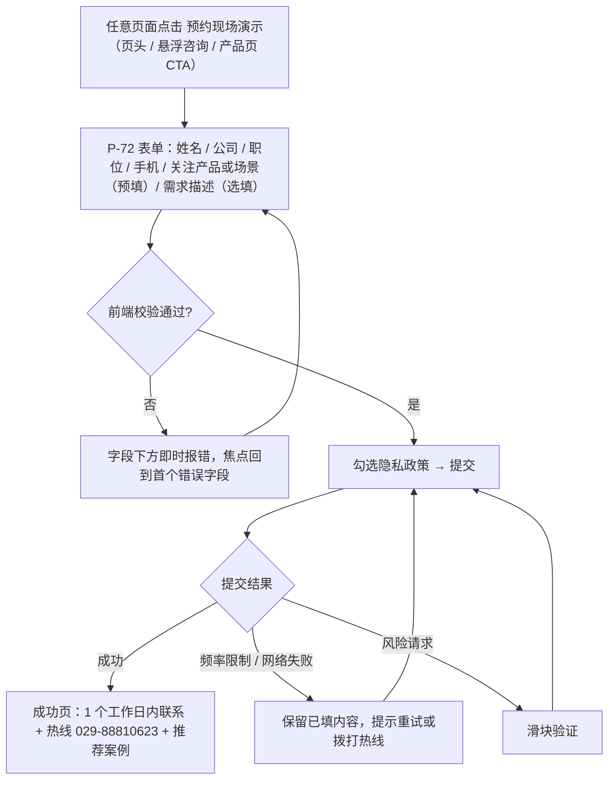
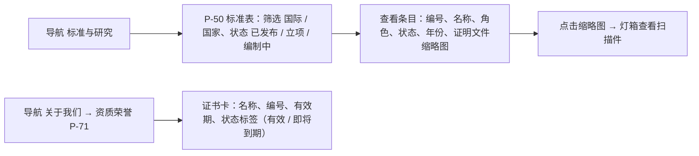
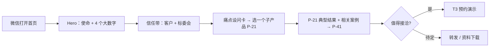

# K-02 网站 UX / 交互设计师：信息架构与可用性

> 组别：K-A 网站设计类 ｜ 版本 v0.2 ｜ 2026-10-08
> 输入变量：
> - **{网站需求}**：华云智联官网 V2.0（[README §3 项目基线](./README.md)、[02 内容呈现与布局](./02-content-and-layout.md)、[03 内容迁移](./03-content-and-asset-migration.md)）
> - **{目标用户}**：工业企业决策者、技术负责人、一线工程负责人、招采人员、合作伙伴、海外客户、政府 / 高校 / 标准组织、求职者、现有客户（报修）
> - **{可用性目标}**：P0 任务成功率 ≥ 90%；SUS ≥ 75；预约演示 ≤ 4 步
> v0.2 变更：依据现网盘点（01）重建站点地图；产品与关于页由"单 URL 多面板"改为独立 URL；新增服务热线、标准核实、合作方任务。

---

## 1. 用户研究摘要

### 1.1 用户角色（Persona）

| 编号 | 角色 | 典型身份 | 目的 | 关注点 | 现网能否满足 |
|---|---|---|---|---|---|
| U1 | 企业决策者 | 集团 / 厂长 / CIO / CTO | 判断是否值得接洽 | 同行业案例、标准与资质背书、投入产出 | 差：首页无产品主张，案例陈旧 |
| U2 | 技术负责人 | 总工、自动化部长、设备部长 | 评估技术可行性 | 能否对接 PLC / DCS / SCADA、私有化部署、模型规模、数据安全 | 中：参数全，但埋在单 URL 长页里 |
| U3 | 一线工程负责人 | 车间主任、巡检班组长 | 了解能否减轻现场负担 | 操作简单、具身巡检、报警处置 | 差 |
| U4 | 招采 / 评标人员 | 采购部、招标代理 | 核实资质与规格 | 证书有效期、标准角色、专利软著编号、技术规格书 | 中：有扫描件，无法检索、无有效期 |
| U5 | 合作伙伴 / 集成商 | 设备厂商、集成商 | 寻找合作 | 生态合作方式、联系人 | 差：无入口 |
| U6 | 海外客户 | 中东、欧洲化工与能源企业 | 了解能力与国际标准地位 | 英文内容、IEC / IEEE / ISO 工作 | 差：无英文站 |
| U7 | 政府 / 高校 / 标准组织 | 主管部门、合作院校 | 了解科研与标准贡献 | 科研项目、实验室、标准 | 中 |
| U8 | 现有客户 | 已上线项目的运维人员 | 报修、找文档 | 7×24 热线、资料下载 | 中：只有电话 |
| U9 | 求职者 | 算法、工程、销售人才 | 了解公司与岗位 | 岗位、投递方式 | 差：无投递方式 |

> 上线前建议对 U1、U2、U4 各访谈 2 人（销售部协助约访）【待确认】。

### 1.2 核心任务与场景

| 任务 | 角色 | 场景 | 优先级 |
|---|---|---|---|
| T1 判断是否值得接洽 | U1 | 同行在微信里转发链接，3 分钟内判断 | P0 |
| T2 评估接入能力 | U2 | 方案比选，查运维之弈能否接现有 DCS、能否私有化 | P0 |
| T3 预约现场演示 | U1、U2、U5 | 判断值得接洽后留资 | P0 |
| T4 核实标准与资质 | U4、U6、U7 | 招标资格审查：标准角色、证书有效期、软著编号 | P0 |
| T5 查找同行业案例 | U1、U2 | 找油气 / 矿山落地证据 | P0 |
| T6 下载资料 | U2、U4 | 内部汇报需要材料（依赖白皮书上线） | P1 |
| T7 联系 7×24 服务 | U8 | 设备报警需要支持 | P1 |
| T8 英文访问并联系 | U6 | 海外客户访问 | P1 |
| T9 查找在招岗位并投递 | U9 | 求职 | P2 |

---

## 2. 信息架构

### 2.1 站点地图与页面编号（所有文档统一引用）

| 层级 1（导航） | 层级 2 | 层级 3 | 编号 | 中文 URL |
|---|---|---|---|---|
| 首页 | — | — | P-01 | `/` |
| 产品与技术 | 平台总览（7+10+2+N · iMoM 3.2） | — | P-20 | `/products` |
| | SpatiGo™ 空间群弈 | 质量之弈 / 运维之弈 / 安全之弈 / 具身之弈 | P-21 | `/products/spatigo`、`/products/spatigo/<quality\|maintenance\|safety\|embodied>` |
| | 工业增强大模型 iMLLM | — | P-22 | `/products/imllm` |
| | 工业智能体应用 | 7 个智能体详情 | P-23 | `/products/agents`、`/products/agents/<slug>` |
| | 智能引擎群 | （页内锚点 7 个） | P-24 | `/products/engines#idce` 等 |
| | 工业软件 | 约 17 款软件详情 | P-25 | `/products/software`、`/products/software/<imes 等>` |
| | 安全与集成 | — | P-26 | `/products/security-integration` |
| 解决方案 | 解决方案总览（行业 × 场景） | 行业方案 ×6 | P-30 / P-31 | `/solutions`、`/solutions/<mining-power 等>` |
| 客户案例 | 案例列表（行业 / 产品 / 场景筛选，含历史案例） | 案例详情 | P-40 / P-41 | `/cases`、`/cases/<slug>` |
| 标准与研究 | 标准与知识产权、科研项目 | — | P-50 | `/research` |
| | 联合实验室 | — | P-51 | `/research/labs` |
| 服务支持 | 7×24 服务、实施方法、资料下载 | 资料详情（表单） | P-60 / P-61 | `/support`、`/support/downloads/<slug>` |
| 新闻中心 | 公司动态 / 行业资讯 / 历史动态 | 新闻详情 | P-80 / P-81 | `/news`、`/news/<yyyy>/<slug>` |
| 关于我们 | 公司介绍（使命、历程、风采） | — | P-70 | `/about` |
| | 资质荣誉 | — | P-71 | `/about/honors` |
| | 合作伙伴 | — | P-73 | `/about/partners` |
| | 联系我们 | — | P-74 | `/about/contact` |
| | 加入我们 | — | P-75 | `/about/careers` |
| （全局 CTA） | 预约现场演示 | — | P-72 | `/demo` |
| （功能页） | 搜索结果 / 404 · 500 / 隐私政策与法律声明 | — | P-90 / P-91 / P-92 | `/search`、—、`/legal/privacy` |

- **层级**：所有内容页 ≤ 3 级（如 产品与技术 → 工业软件 → iMES），无超限。
- **一级导航 7 项**：产品与技术 · 解决方案 · 客户案例 · 标准与研究 · 服务支持 · 新闻中心 · 关于我们。
- **全局工具**：顶部工具条（7×24 热线 029-88810623）、搜索、中 / EN、"预约现场演示"按钮、右下角可折叠悬浮咨询（预约演示 / 电话 / 微信二维码 / 返回顶部）。
- **英文站**：路由前缀 `/en/`；P1 首批页面：P-01、P-20、P-21（含子页）、P-41（精选 2 个）、P-50、P-70、P-74、P-72。
- **横向互链**：产品 ↔ 行业方案 ↔ 案例 ↔ 标准；每个详情页底部至少 2 个相关推荐。
- **旧站 301**：见 [03 §5](./03-content-and-asset-migration.md)。

### 2.2 导航菜单结构（下拉）

| 一级 | 下拉布局 |
|---|---|
| 产品与技术 | 三栏：①平台（平台总览、iMLLM、引擎群、安全与集成）②旗舰 SpatiGo™（4 子产品，带图标与一句话）③应用与软件（智能体应用、工业软件）；底部推荐卡"预约 SpatiGo™ 现场演示" |
| 解决方案 | 两栏：按行业（6）/ 按场景（6） |
| 关于我们 | 单栏 5 项 |
| 其余 | 直接链接，无下拉 |

---

## 3. 关键任务流程

### 3.1 T3 预约现场演示（目标 ≤ 4 步）

步数：①点击 CTA → ②填写 → ③勾选并提交 → ④成功页 = **4 步**。

### 3.2 T4 核实标准与资质（目标 ≤ 3 次点击）

异常分支：搜索某一标准编号无结果 → 搜索页给出"标准与研究"入口 + 联系方式。

### 3.3 T1 判断是否值得接洽（目标 ≤ 3 次点击、≤ 180 秒）

### 3.4 T2 评估接入能力（目标 ≤ 4 次点击）
首页痛点卡"设备总在计划外停机？"→ P-21 运维之弈 →"部署与接入"区块（PLC / DCS / SCADA、私有化、1.3B 起部署）→ 展开"技术规格"或 P-26 协议矩阵。
异常分支：信息不足 → 区块内"向工程师咨询"进入 T3 表单，"关注产品"预填"运维之弈 · 系统接入"。

### 3.5 T5 查找同行业案例（目标 ≤ 3 次点击）
导航"客户案例"→ 筛选"石油化工"→ 案例详情。异常：筛选无结果 → 空态显示"该行业案例整理中"+ 相近行业案例 + 预约入口。

### 3.6 T7 联系 7×24 服务（目标 ≤ 1 次点击）
任意页面顶部工具条或悬浮咨询的"7×24 热线"→ 移动端直接拨号（`tel:02988810623`），PC 端显示号码与服务时间说明。

### 3.7 任务目标汇总

| 任务 | 目标步数 / 点击 | 目标时长（中位数） |
|---|---|---|
| T1 判断是否接洽 | ≤ 3 次点击 | ≤ 180 s |
| T2 评估接入能力 | ≤ 4 次点击 | ≤ 120 s |
| T3 预约演示 | ≤ 4 步 | ≤ 90 s |
| T4 核实标准与资质 | ≤ 3 次点击 | ≤ 60 s |
| T5 同行业案例 | ≤ 3 次点击 | ≤ 60 s |
| T6 资料下载 | ≤ 4 步（回访 2 步） | ≤ 60 s |
| T7 联系 7×24 | ≤ 1 次点击 | ≤ 15 s |
| T8 英文联系 | ≤ 3 次点击 | ≤ 60 s |
| T9 岗位投递 | ≤ 3 次点击 | ≤ 90 s |

---

## 4. 线框图 / 原型页面要素表

| 页面 | 区块 | 组件 | 交互说明 |
|---|---|---|---|
| 全局 | 工具条 + 页头 | TopBar、Header、NavDropdown、MobileNav、SearchOverlay、LangSwitch | 工具条只在 ≥ md 显示；滚动 80px 后页头变实色并收窄；下拉悬停 150ms 后打开；键盘 Enter / Space 打开、Esc 关闭；语言切换跳到同一页面的另一语种（无对应页时跳英文首页并提示） |
| 全局 | 悬浮咨询 | FloatingCTA | 首屏不显示，滚动超过 1 屏后出现；默认折叠为一个按钮，展开为"预约演示 / 热线 / 微信 / 顶部"；移动端改为底部吸附条 |
| P-01 | 公告条 | AnnouncementBar | 关闭后 7 天不显示 |
| P-01 | Hero + 大数字 | Hero、ArchMotion（SVG 动效）、StatGroup×4 | 动效 SVG 可暂停；数字首次进入视口计数；脚注编号锚点跳到页底口径 |
| P-01 | 信任带 | LogoWall、CommitteeBadges | Logo 灰度，悬停彩色，不可点击 |
| P-01 | 痛点设问卡 | PainCard×4（Bento） | 整卡可点击进入 P-21 子页；移动端单列 |
| P-01 | 平台架构 | ArchDiagram | 点击层级展开说明面板，面板内链接 P-22—P-25；移动端为手风琴 |
| P-01 | 现场证据 | CaseTabs、MediaBlock、StatGroup | Tab 键盘左右切换；视频静音、可暂停 |
| P-01 | 部署与安全 | RangeChart、DeployCard×3 | — |
| P-01 | 行业方案 | Tabs（6） | 移动端改为下拉选择 |
| P-01 | 标准与研究 · 资质 | StandardCard×4、StatInline、CertCarousel | 证书卡点击打开灯箱 |
| P-01 | 新闻 | NewsCard×3 | 条件显示（近 12 个月 ≥ 3 篇） |
| P-21 / P-23 / P-25 | 详情 | 面包屑、ProductHero、PainList、CapabilityGrid、FlowDiagram、StatGroup、RelatedCases、Accordion（技术规格）、DownloadButton、CTABand | 页内锚点子导航吸顶；规格展开状态写入 URL hash |
| P-40 | 列表 | FilterBar（行业 / 产品 / 场景 / 历史）、CaseCard、Pagination、EmptyState | 筛选写入 URL 查询参数；骨架屏 |
| P-50 | 标准与研究 | CommitteeBadges、StandardCard、DataTable×4（标准 / 专利 / 软著 / 科研）、Lightbox | 表格可筛选、可按编号搜索；移动端卡片化 |
| P-71 | 资质荣誉 | CertCard（有效期 + 状态标签）、AwardCard（等级标签） | 灯箱查看 |
| P-72 | 预约演示 | LeadForm、TrustAside（客户 + 热线） | 见 §3.1 |
| P-61 | 资料下载 | ResourceDetail、LeadForm（4 字段） | 30 天内已登记直接下载 |
| P-74 | 联系我们 | ContactCard、MapLink、QRCode | 地址点击打开地图应用；电话可拨 |
| P-75 | 加入我们 | JobAccordion | 每个岗位提供投递邮箱【待确认】 |
| P-90 | 搜索 | SearchBox、ResultGroup（产品 / 案例 / 标准 / 新闻） | 关键词高亮；支持标准编号、i 系列编码检索 |

> 低保真线框在 Figma `06 交互说明` 页按上表逐页绘制，编号与本表一致。

---

## 5. 可用性测试方案

| 项 | 内容 |
|---|---|
| 轮次 | R0：现网基线测试（T0+W1，用现网完成同样任务，作对照）；R1：可点击线框（W3）；R2：高保真原型（W6）；R3：上线后 30 天线上复测（W16） |
| 样本量 | 每轮 **8 人**：U1 ×2、U2 ×2、U4 ×1、U3 ×1、U6 ×1（英文，R2 起）、U8 ×1 |
| 方式 | 远程有主持测试（腾讯会议录屏）+ 有声思维；移动任务在受试者手机微信内完成 |
| 设备 | PC 4 人 + 移动 4 人 |

### 5.1 测试任务

| 任务 | 任务描述（给受试者） | 成功标准 | 时长上限 |
|---|---|---|---|
| T1 | "你是某油田的设备部长，同事发来这个链接。请判断这家公司有没有在油气现场落地过。" | 说出 1 个油气相关案例及结果 | 180 s |
| T2 | "确认他们的设备预测性维护能否接入你们现有的 DCS，能否私有化部署。" | 到达运维之弈接入区块或 P-26，并说出结论 | 120 s |
| T3 | "请预约一次现场演示。" | 成功页出现 | 90 s |
| T4 | "招标要求提供有效期内的高新技术企业证书，请确认这家公司是否有效。" | 找到证书并说出有效期 | 60 s |
| T7 | "你们的系统报警了，需要马上联系厂家技术支持。" | 找到 7×24 热线（移动端触发拨号） | 15 s |
| T8 | （英文）"Find out whether this company works on international AI standards and how to contact them." | 到达英文标准区并找到联系方式 | 60 s |

### 5.2 SUS 评分计划
- 每轮结束填写 SUS 10 题标准量表（中文版，5 点李克特）；计分：奇数题（得分 − 1）、偶数题（5 − 得分），求和 × 2.5。
- 目标：R0 记录基线；R2 ≥ 75；R3 ≥ 78。每个任务后记录单题难易度（SEQ，7 点）。

---

## 6. 验收指标

### 6.1 目标值

| 指标 | 定义 / 统计口径 | 目标值 |
|---|---|---|
| 任务成功率 | 时长上限内无提示完成的人数 / 样本数，按任务计 | 每个任务 ≥ 87.5%（8 人中 ≥ 7 人）；P0 任务均值 ≥ 90%；且显著高于 R0 基线 |
| 平均完成时长 | 成功者完成时长的中位数（失败者单独报告） | ≤ §3.7 目标时长 |
| 错误次数 | 偏离最优路径的点击（含返回）+ 表单校验报错，人均 | ≤ 1 次 / 任务 |
| SUS | 见 §5.2 | R2 ≥ 75 |
| 线上表单完成率（R3） | 预约演示提交成功数 / P-72 访问数 | ≥ 25% |
| 收录（R3） | 搜索引擎收录 URL 数 | ≥ 150（G5） |

### 6.2 实测记录表（模板）

| 轮次 | 任务 | 受试者 | 角色 | 终端 | 是否成功 | 时长（s） | 错误次数 | SEQ | 问题描述 | 严重度 |
|---|---|---|---|---|---|---|---|---|---|---|
| R1 | T1 | S01 | U2 | 移动 | 是 / 否 | | | | | 阻断 / 严重 / 一般 |

### 6.3 汇总表（模板）

| 任务 | R0 成功率 | R2 成功率 | 时长中位数 | 人均错误 | SEQ 均值 | 是否达标 |
|---|---|---|---|---|---|---|
| T1 | | | | | | |
| … | | | | | | |
| **SUS** | | | — | — | — | |

**问题处理**：阻断级问题下一轮前必须修复；严重问题由 UX 与产品共同决定修复版本；一般问题进入迭代池。
