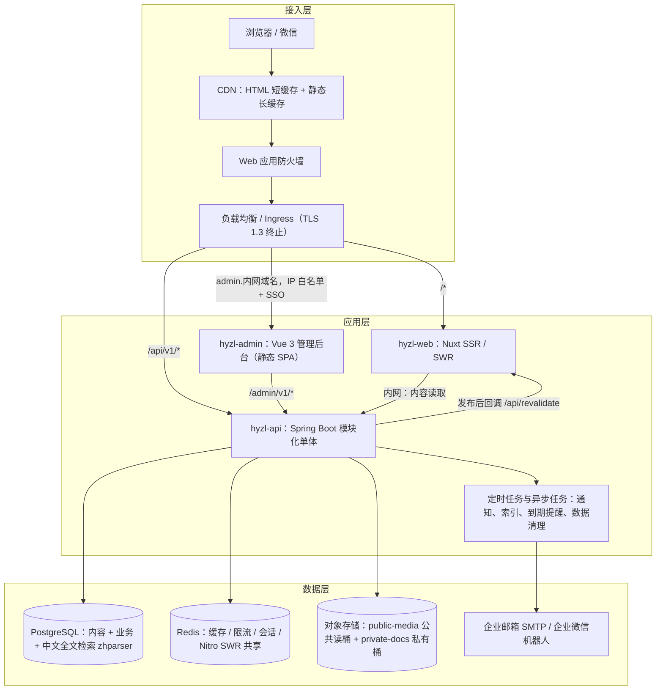
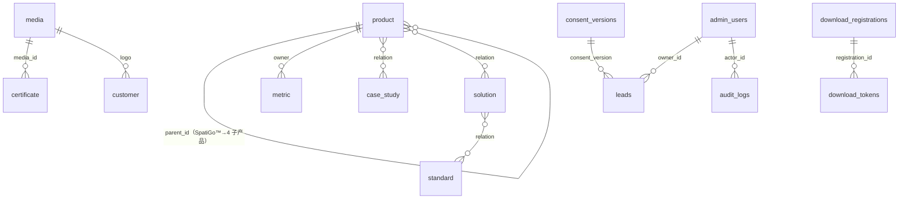

# K-05 后端开发工程师：接口与数据设计

> 组别：K-B 网站开发类 ｜ 版本 v0.2 ｜ 2026-10-08
> 输入变量：
> - **{业务需求}**：①内容管理（产品约 39 条、解决方案 12、案例 6—8、标准 34、专利 12、软著 28、科研项目 16、奖项 14、证书 6、合作伙伴 43、新闻 26+、岗位、页面）及审核发布；②预约演示与联系线索；③资料登记下载；④站内搜索（支持 i 系列编码、标准编号）；⑤前端性能上报；⑥证书有效期与客户授权到期提醒；⑦缓存刷新
> - **{并发与数据规模}**：日均 PV 3,000—10,000（页面经 CDN 与 SWR 缓存）；动态接口峰值 50 QPS，压测目标 200 QPS；内容 ≤ 3,000 条；线索 ≤ 5 万条 / 年；RUM ≤ 50 万条 / 日（采样后入库）
> - **{技术栈约束}**：**与公司后端团队技能一致**（招聘要求 Spring Cloud、Spring Boot、Docker、REST、PostgreSQL）；数据境内存储；国密算法优先（公司产品采用 TLS 1.3 + SM4）；容器化
> v0.2 变更：由 NestJS + Strapi 改为 **Spring Boot 模块化单体 + 自建内容管理**；内容模型按现网真实内容设计；新增证书有效期、客户授权、内容版本、标准状态等字段；搜索改用 PostgreSQL 中文全文检索。

---

## 1. 架构框图



### 1.1 模块清单（hyzl-api 内按包划分，后续可拆为 Spring Cloud 服务）

| 模块 | 技术 | 职责 |
|---|---|---|
| `content` | Spring Boot 3.x（Java 21 LTS）、MyBatis-Plus、Flyway | 公开内容只读接口；中英文多语言；草稿 / 审核 / 发布；版本历史 |
| `media` | 同上 + 对象存储 SDK | 上传、图片元数据（尺寸、alt、敏感审查标记）、证书水印处理、私有文件签名 URL |
| `lead` | 同上 | 预约演示 / 联系 / 合作线索：校验、去重、分配、通知、状态流转 |
| `download` | 同上 | 资料登记、下载凭证、下载统计 |
| `search` | PostgreSQL 全文检索（zhparser 中文分词）+ 编码精确匹配 | 内容发布时写入索引表；查询与高亮 |
| `rum` | 同上 | Web Vitals 批量接收、采样、分区表写入 |
| `admin` | Spring Security + OIDC | 后台接口：内容维护、线索管理、导出、用户与角色、审计 |
| `job` | Spring Scheduling + 数据库 outbox | 通知发送重试、证书 / 授权到期提醒、索引重建、过期数据清理、缓存刷新回调 |
| `hyzl-admin` | Vue 3 + Element Plus（或 Ant Design Vue）+ TipTap 富文本 | 内容编辑后台（与公司现有产品技术栈一致） |

> 网站规模小，采用"模块化单体"降低运维成本；模块边界清晰，流量增长后可按 `lead`、`search` 拆分。

---

## 2. API 设计表

**约定**：RESTful；前缀 `/api/v1`（公开）、`/admin/v1`（后台）；JSON UTF-8；时间 ISO 8601（UTC 存储，Asia/Shanghai 展示）；多语言参数 `locale=zh|en`；响应头带 `X-Request-Id`；分页 `page`（从 1 开始）、`size`（≤ 50）。

**统一错误体**：

```json
{ "code": "VALIDATION_FAILED", "message": "手机号格式不正确", "requestId": "req_7f3c…", "details": [{ "field": "phone", "rule": "pattern" }] }
```

### 2.1 公开内容接口（只读，服务端缓存 300 s，发布时清除）

| 端点 | 方法 | 主要参数 | 响应要点 | 错误码 | 限流 |
|---|---|---|---|---|---|
| `/content/pages/{key}` | GET | key：home / platform / support / about / contact / security-integration / privacy | 页面区块（JSON 区块数组） | 404 `PAGE_NOT_FOUND` | 每 IP 120 次 / 分 |
| `/content/products` | GET | `type`=platform / model / flagship / sub_product / agent / engine / software；`featured`；`group`=standard / advanced | 列表：code、slug、名称（中 / 英）、定位、图标、排序 | 400 | 同上 |
| `/content/products/{slug}` | GET | — | 详情：区块、能力、指标（含口径脚注）、规格、关联产品 / 案例 / 方案 / 标准、规格书文件 | 404 | 同上 |
| `/content/solutions`、`/content/solutions/{slug}` | GET | `kind`=industry / scenario | 行业 / 场景及关联 | 404 | 同上 |
| `/content/cases`、`/content/cases/{slug}` | GET | `industry`、`product`、`legacy` | **只返回 `authorized=true` 且未过期**的案例；含结果数字 | 404 | 同上 |
| `/content/standards` | GET | `scope`=national / international；`status`=published / project / drafting / proof | 编号、名称、角色、状态、年份、文件缩略图 | 400 | 同上 |
| `/content/patents`、`/content/copyrights`、`/content/projects`、`/content/awards` | GET | 分类 / 级别 / 年份 | 结构化列表 | 400 | 同上 |
| `/content/certificates` | GET | — | 只返回有效期内证书，含 `status`=valid / expiring（≤ 60 天） | — | 同上 |
| `/content/customers` | GET | `authorized=true`（服务端强制） | 名称、Logo、行业 | — | 同上 |
| `/content/partners` | GET | `category`=university / industry / research / integrator | 名称、Logo | — | 同上 |
| `/content/labs`、`/content/milestones`、`/content/jobs`、`/content/resources` | GET | — | 列表 | — | 同上 |
| `/content/news`、`/content/news/{slug}` | GET | `category`=company / industry；`archived`；`within`（天）；分页 | 列表 / 详情（含原发布日期、来源） | 404 | 同上 |

### 2.2 公开业务接口

| 端点 | 方法 | 请求 | 响应（成功） | 错误码 | 限流策略 |
|---|---|---|---|---|---|
| `/leads` | POST | `{ type: "demo"\|"contact"\|"partner"\|"job", name, company, title?, phone?, email?, productInterest?, scenario?(≤500 字), locale, sourcePage, utm?, consentVersion, captchaTicket? }`；手机与邮箱至少一项 | `201 { id, status: "received" }`；24 小时内同一手机 / 邮箱重复提交返回 `200` 和原 id | 400 `VALIDATION_FAILED`；422 `CAPTCHA_REQUIRED` / `CAPTCHA_INVALID`；429 `RATE_LIMITED` | 每 IP 5 次 / 10 分；每手机 3 次 / 天；超阈值触发验证码 |
| `/downloads` | POST | `{ resourceSlug, name, company, email, industry, locale, consentVersion, captchaTicket? }` | `201 { downloadToken, expiresAt }` + `Set-Cookie: dl_reg`（HttpOnly、Secure、30 天） | 400；404 `RESOURCE_NOT_FOUND`；422；429 | 每 IP 10 次 / 10 分 |
| `/downloads/status` | GET | `?resource=<slug>` | `200 { registered }` | 404 | 每 IP 60 次 / 分 |
| `/downloads/{token}` | GET | — | `302` → 私有桶签名 URL（10 分钟有效） | 404 `TOKEN_NOT_FOUND`；410 `TOKEN_EXPIRED` | 每 token 5 次 |
| `/search` | GET | `?q=`（1—50 字）`&type=&locale=&page=` | `200 { total, hits: [{ type, title, snippet(高亮), url }] }`；`q` 为 i 系列编码（如 iMES）或标准编号（如 IEC 63270）时精确匹配优先 | 400 | 每 IP 30 次 / 分；结果缓存 60 s |
| `/rum` | POST | `{ items: [{ name, value, rating, path, device, connection }] }`（≤ 20 条） | `204` | 400；413 | 每 IP 60 次 / 分；服务端 20% 采样 |
| `/actuator/health` | GET | — | `UP` / `DOWN`（仅内网与探针可达） | 503 | — |

### 2.3 后台接口（`/admin/v1`，SSO + RBAC + 办公网 IP 白名单）

| 端点 | 方法 | 说明 | 角色 |
|---|---|---|---|
| `/content/{type}`、`/content/{type}/{id}` | GET / POST / PUT / DELETE | 各内容类型维护（软删除） | editor |
| `/content/{type}/{id}/submit`、`/review`、`/publish`、`/unpublish` | POST | 草稿 → 待审 → 已发布；发布写版本快照、更新搜索索引、触发前端缓存刷新 | editor 提交 / reviewer 审核发布 |
| `/content/{type}/{id}/revisions`、`/revisions/{rev}/restore` | GET / POST | 版本历史与回退 | reviewer |
| `/media` | POST（multipart） | 上传；自动读取尺寸；证书类自动加水印；必填 alt；标记"已过敏感审查" | editor |
| `/import/{type}` | POST（CSV） | 标准、专利、软著、科研项目、奖项批量导入（预检 → 确认） | admin |
| `/leads`、`/leads/{id}` | GET / PATCH | 列表默认脱敏；PATCH `{ status, ownerId, notes }`；查看明文写审计 | lead_manager / sales（仅本人负责的线索） |
| `/leads/export` | POST | 异步生成带水印 CSV（≤ 5,000 条） | admin |
| `/downloads/stats` | GET | 按资料、按天 | editor / admin |
| `/alerts` | GET | 证书 / 客户授权到期、待审内容 | admin |
| `/users`、`/roles` | GET / POST / PATCH | 用户与角色 | admin |

**线索状态机**：`new → assigned → contacted → qualified | invalid`；`invalid` 可回到 `assigned`；非法流转返回 409 `INVALID_TRANSITION`。
**内容状态机**：`draft → in_review → published → unpublished`；`in_review` 可退回 `draft`。

### 2.4 内部回调
- `POST {web}/api/revalidate`：发布后由 `job` 调用，Body `{ paths[], keys[] }`，Header `X-Signature`（HMAC-SHA256 + 时间戳，5 分钟窗口），失败按 1 / 5 / 30 分钟重试（outbox）。

---

## 3. 数据表设计（PostgreSQL 16+，Flyway 管理）

### 3.1 内容表

**命名约定**：业务主表存与语言无关的字段，`*_i18n` 表存语言相关字段（`entity_id, locale, …`，主键 `(entity_id, locale)`）；所有内容表含 `status`、`sort`、`created_at`、`updated_at`、`published_at`、`deleted_at`。

| 表 | 关键字段 | 说明 |
|---|---|---|
| `product` | id、**type**（platform / model / flagship / sub_product / agent / engine / software）、**code**（如 iMES、iDCE、iMoM 3.2，UNIQUE）、slug（UNIQUE）、parent_id（如 4 个子产品 → SpatiGo™）、software_group（standard / advanced）、icon_media_id、spec_doc_media_id、featured | 03 §2 唯一清单 |
| `product_i18n` | name、name_en_label（英文副标题）、tagline、positioning、blocks（jsonb：能力 / 流程 / 部署 / 规格）、seo_title、seo_desc | — |
| `metric` | id、owner_type、owner_id、value、unit、label_i18n（jsonb）、**footnote_i18n（jsonb，必填）**、as_of_date | 落实"数字必附口径" |
| `solution` / `solution_i18n` | kind（industry / scenario）、slug；pain_points、blocks | — |
| `case_study` / `case_i18n` | slug、industry、**authorized**、auth_doc_media_id、**auth_expires_at**、**is_legacy**、featured；customer_display_name、challenge、solution、timeline（jsonb）、results | 历史案例 is_legacy=true |
| `standard` | code（如 IEC 63270-1:2025）、**scope**（national / international）、org、**role**（chief_editor / co_editor / member）、**status**（published / project / drafting / proof）、year、doc_media_ids（int[]） | 对应 01 E21 |
| `standard_i18n` | name | — |
| `patent` | number（专利号或申请号）、**kind**（invention / utility / design）、**state**（granted / pending）、title_zh、cert_media_id | 对应 E22 |
| `software_copyright` | reg_no（如 2025SR0987256，UNIQUE）、title_zh、version、year、cert_media_id | 28 条 |
| `research_project` | level（national / provincial_city）、year、title_zh、source、role、status（closed / ongoing）、amount_wan（numeric，可空） | 16 条；"—"存 NULL |
| `award` | title_zh、grade_label（一等奖 / 二等奖 / 三等奖 / 优秀奖 / 银奖 / 季军）、year_label（如 2019-2020）、cert_media_id | 14 条 |
| `certificate` | name、number、issuer、**issued_at**、**expires_at**、media_id | 到期前 60 天提醒，过期不对外返回 |
| `customer` | name、logo_media_id、industry、**authorized**、auth_doc_media_id、**auth_expires_at** | 与 partner 分表 |
| `partner` | category（university / industry / research / integrator）、name、logo_media_id、relationship_confirmed_at | 43 条 |
| `lab`、`milestone`、`job`、`resource`（gated、file_media_id 私有桶） | 各自字段 + i18n | — |
| `news` / `news_i18n` | category（company / industry）、slug、**is_archived**、published_at（原发布日期）、source；title、summary、body（富文本，服务端白名单清洗） | 2018—2020 年新闻 is_archived=true |
| `page` | key（UNIQUE）、blocks_i18n（jsonb） | 单例页面 |
| `media` | id、bucket（public-media / private-docs）、path、mime、width、height、alt_zh、alt_en、**watermarked**、**sensitivity_checked**、source_path（对应素材库路径） | 与 asset-mapping.csv 对应 |
| `content_revision` | id、entity_type、entity_id、version、snapshot（jsonb）、editor_id、created_at | 版本历史 |
| `relation` | from_type、from_id、to_type、to_id、sort | 产品—案例—方案—标准多对多 |

### 3.2 业务表

| 表 | 关键字段 | 索引 |
|---|---|---|
| `leads` | id (uuid)、type、name、company、title、**phone_enc / email_enc（bytea，SM4-GCM 加密）**、**phone_hash / email_hash（HMAC，用于去重）**、product_interest、scenario、locale、source_page、utm_*、ip_hash、consent_version、consent_at、status、owner_id、notes、created_at、updated_at、deleted_at | `(created_at DESC)`、`(status, created_at DESC)`、`(phone_hash, created_at)`、`(email_hash, created_at)`、`(owner_id, status)` |
| `download_registrations` | id、resource_slug、name、company、email_enc、email_hash、industry、locale、consent_version、consent_at、ip_hash、utm_*、created_at | `(resource_slug, created_at)`、`(email_hash)` |
| `download_tokens` | id、registration_id（FK，级联删除）、token_hash（UNIQUE）、expires_at、used_count、last_used_at | `(expires_at)` |
| `consent_versions` | version（PK）、content_sha256、effective_at、locale | — |
| `admin_users` | id、sso_subject（UNIQUE）、display_name、role、status、last_login_at | — |
| `audit_logs` | id（bigserial）、actor_id、action（view_pii / publish / export / restore …）、target_type、target_id、diff（jsonb）、ip_hash、created_at | `(target_type, target_id)`、`(actor_id, created_at)`；只追加 |
| `outbox_events` | id、event_type、payload（jsonb）、status、attempts、next_run_at | `(status, next_run_at)` |
| `search_documents` | entity_type、entity_id、locale、title、body、code（i 系列编码 / 标准编号）、url、tsv（tsvector，zhparser 配置） | GIN(tsv)、`(code)`、`UNIQUE(entity_type, entity_id, locale)` |
| `rum_metrics` | id、metric、value、rating、path、device、connection、created_at | 按日分区，保留 90 天 |

### 3.3 关联关系（主要）



---

## 4. 性能设计与压测

### 4.1 目标

| 接口 | 压测 QPS | P95 | P99 | 错误率 |
|---|---|---|---|---|
| 内容读取（缓存命中） | 300 | ≤ 50 ms | ≤ 150 ms | < 0.1% |
| 内容读取（缓存未命中） | 50 | ≤ 200 ms | ≤ 500 ms | < 0.1% |
| `POST /leads`、`POST /downloads` | 50 | ≤ 200 ms | ≤ 500 ms | < 0.1% |
| `GET /search` | 100 | ≤ 150 ms | ≤ 400 ms | < 0.1% |
| `POST /rum` | 300 | ≤ 50 ms | ≤ 150 ms | < 0.5% |
| 混合场景 | **200** | ≤ 200 ms | ≤ 500 ms | < 0.1% |

### 4.2 缓存策略

| 对象 | 位置 | 失效 |
|---|---|---|
| HTML | CDN + Nuxt SWR（Redis） | 3600 s；发布时按路由清除 |
| 内容接口 | Spring Cache（Redis） | 300 s；发布时按内容类型清除 |
| 搜索结果 | Redis | 60 s；发布时清除 `search:*` |
| 限流计数 | Redis | 滑动窗口 |
| 下载登记 | HttpOnly Cookie + Redis | 30 天 |

### 4.3 压测方案
- 工具：k6（脚本在 `perf/`；团队熟悉也可用 JMeter），同地域独立压测机。
- 环境：预发，与生产 1:1；数据量模拟 5 万线索、3,000 条内容。
- 场景：①基准 10 QPS × 5 分；②负载爬坡到目标 × 15 分；③峰值混合 200 QPS × 10 分；④稳定性 100 QPS × 2 小时；⑤限流验证（单 IP 超阈值返回 429）。
- 通过标准：满足 §4.1；JVM CPU < 70%、堆内存稳定、无 Full GC 风暴；数据库连接池使用率 < 80%；HikariCP 等待 < 10 ms。
- 外部依赖（验证码、邮件、企业微信）用桩服务。

### 4.4 压测结果表（模板）

| 场景 | 接口 | 目标 QPS | 实测 QPS | P95 | P99 | 错误率 | CPU 峰值 | 连接池峰值 | GC 暂停 P99 | 结论 |
|---|---|---|---|---|---|---|---|---|---|---|

---

## 5. 安全措施清单

| 类别 | 措施 |
|---|---|
| 鉴权 | 后台 OIDC 单点登录（企业微信 / 钉钉 / 飞书之一【待确认】）+ RBAC（admin / reviewer / editor / lead_manager / sales / viewer）；无 SSO 时启用账号密码 + TOTP 双因素；会话 8 小时，集中存 Redis，注销加入黑名单（与公司产品"安全与可靠性"规范一致） |
| 服务间认证 | web → api 内网 + 服务令牌；回调 HMAC 签名 + 时间戳 + 幂等键 |
| 参数校验 | Bean Validation（JSR 380）DTO 白名单，拒绝未知字段；规则与前端共享（由 OpenAPI 生成） |
| 防注入 | MyBatis-Plus 只用 `#{}` 参数绑定，CI 中静态检查禁止 `${}`；搜索词转义后传入 `plainto_tsquery` |
| XSS | 富文本服务端 OWASP Java HTML Sanitizer 白名单；前端默认转义；CSP `default-src 'self'`，脚本 nonce |
| CSRF | 公开 POST 校验 Origin / Referer；Cookie `SameSite=Lax; Secure; HttpOnly`；后台使用 Spring Security CSRF Token |
| 防刷 | Redis 限流（§2）+ 风险触发式验证码（云厂商）+ WAF（Bot 管理、CC 防护） |
| 敏感数据加密 | 手机号、邮箱字段级 **SM4-GCM** 加密（BouncyCastle），密钥由云 KMS 托管、每年轮换；去重用 HMAC 哈希；后台默认脱敏（138****1234），查看明文写审计 |
| 传输 | 全站 HTTPS，TLS 1.2+（优先 1.3），HSTS；可选国密 SSL 双证书【P2】 |
| 文件 | 私有桶 + 10 分钟签名 URL；上传限制类型与大小（图片 ≤ 10 MB、PDF ≤ 50 MB），服务端校验文件头 |
| 内容合规 | 客户 / 案例未授权或授权过期不对外返回；证书过期不对外返回；量化指标无脚注不允许发布（后台校验） |
| 个人信息保护 | 表单展示隐私政策链接并记录同意版本；线索保留期【待确认，建议 3 年】，到期自动删除；支持删除请求（软删除后 30 天内物理删除）；数据境内存储 |
| 日志与审计 | 日志不记录个人信息明文；审计日志只追加，保留 ≥ 3 年；操作日志 ≥ 180 天 |
| 依赖与镜像 | OWASP Dependency-Check、镜像漏洞扫描；高危阻断发布 |
| 等保 | 网站按等保 2.0 二级要求建设【待确认是否定级备案】 |

---

## 6. 交付清单

| 交付物 | 内容 |
|---|---|
| API 文档 | OpenAPI 3.1（springdoc 生成，人工校对，`apps/api/openapi.yaml`）；前端据此生成 TypeScript 类型与 Zod 校验 |
| 数据库 | Flyway 迁移脚本（`V1__init.sql`…）、初始数据（consent_versions、枚举、页面 key）、ER 图；zhparser 扩展安装说明 |
| 数据导入工具 | `/admin/v1/import/{type}` + CSV 模板（标准、专利、软著、科研项目、奖项、证书、合作伙伴），模板字段与 §3.1 一致；首批数据由 `素材库/官网补录文字.txt` 表格整理 |
| 管理后台 | hyzl-admin（Vue 3）：内容列表 / 编辑 / 审核 / 版本、媒体库、线索管理、到期提醒看板 |
| 部署配置 | Dockerfile（api：`eclipse-temurin:21-jre`，非 root；admin：Nginx 静态）；Helm Chart / docker-compose；环境变量清单：`SPRING_DATASOURCE_*`、`SPRING_DATA_REDIS_*`、`OSS_*`、`KMS_KEY_ID`、`HMAC_SECRET`、`REVALIDATE_SECRET`、`CAPTCHA_*`、`SMTP_*`、`WECOM_WEBHOOK`、`OIDC_*` |
| 日志规范 | Logback JSON：`ts`、`level`、`service`、`env`、`version`、`requestId`、`traceId`、`spanId`、`route`、`status`、`latencyMs`、`errorCode`（不含个人信息） |
| 监控埋点 | Micrometer → Prometheus：`http_server_requests_seconds{uri,status}`、`hyzl_leads_created_total{type}`、`hyzl_downloads_total{resource}`、`hyzl_captcha_challenges_total`、`hyzl_rate_limited_total{route}`、`hyzl_outbox_pending`、`hyzl_publish_total{type}`、`hyzl_cert_days_to_expire{name}`；JVM 与 HikariCP 指标；OpenTelemetry Java Agent 链路（与 K-07 §4 对齐） |
| 测试 | service 层单元测试覆盖率 ≥ 80%；Testcontainers（PostgreSQL + Redis）集成测试；k6 脚本 |
