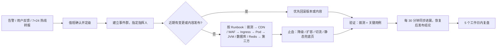

# K-07 网站运维工程师（SRE）：部署、监控与应急

> 组别：K-C 网站运维类 ｜ 版本 v0.2 ｜ 2026-10-08
> 输入变量：
> - **{网站系统}**：hyzl-web（Nuxt SSR）、hyzl-api（Spring Boot）、hyzl-admin（Vue 3 静态后台）、PostgreSQL（含 zhparser）、Redis、对象存储（public-media / private-docs）、CDN、WAF（架构见 K-05 §1）
> - **{可用性目标}**：对外页面月可用性 99.9%；线索提交成功率 99.9%
> - **{流量规模}**：日均 PV 3,000—10,000；展会 / 发布会峰值 10 倍；动态接口峰值 50 QPS（压测容量 200 QPS）
> v0.2 变更：组件随技术栈调整；新增旧站 301 与 404 监控、证书 / 授权到期监控、自托管视频；部署形态给出 A / B 两档；与公司产品"安全与可靠性"规范（K8s + Nginx、日志 ≥ 180 天、Redis 会话、RBAC）对齐。

---

## 1. 部署方案

### 1.1 基础设施（中国内地，单地域双可用区）【待确认云厂商】

| 组件 | 方案 A（推荐：托管 K8s） | 方案 B（低成本：云主机 + Compose） |
|---|---|---|
| 计算 | 托管 Kubernetes，3 个工作节点 4C8G，跨 2 可用区 | 2 台 4C8G 云主机（不同可用区）+ Docker Compose，负载均衡双活 |
| 发布 | Helm + 灰度（Ingress 权重） | 蓝绿（两套 Compose 项目切换负载均衡后端） |
| PostgreSQL 16+ | 云数据库主备高可用（需支持 zhparser 扩展，或自建于 K8s StatefulSet）【确认云厂商是否支持】 | 同左 |
| Redis 7 | 云 Redis 主备 1 GB | 同左 |
| 对象存储 | public-media（公共读，CDN 回源）+ private-docs（私有，签名访问），开启版本控制 | 同左 |
| CDN + WAF + 负载均衡 | 云服务；HTTPS 证书自动续期 | 同左 |
| 镜像仓库 | 云容器镜像服务（漏洞扫描） | 同左 |

> 公司产品本身采用"Kubernetes 集群 + Nginx 负载均衡 + PostgreSQL 逻辑复制 + 跨区域冷备"，团队有 K8s 经验，推荐方案 A。

### 1.2 环境划分

| 环境 | 用途 | 域名（示例） | 数据 | 部署触发 |
|---|---|---|---|---|
| 开发 dev | 联调 | 本地 docker-compose | 假数据 | 本地 |
| 测试 test | K-06 测试、K-03 走查 | `test.huayunzhilian.cn`（仅办公网） | 脱敏样例 + 已录入内容副本 | 合并到 `develop` 自动部署 |
| 预发 staging | 压测、上线前验证、内容最终核对 | `staging.huayunzhilian.cn`（仅办公网） | 生产内容副本（不含线索个人信息） | 打 `rc` tag |
| 生产 prod | 对外服务 | `www.huayunzhilian.cn`；后台 `admin.huayunzhilian.cn`（仅办公网 + SSO） | 真实数据 | 正式 tag + 人工审批 |

> 内容在生产后台编辑；每周把生产内容同步到测试 / 预发（剔除线索、下载登记等个人信息）。

### 1.3 发布策略

| 服务 | 策略 | 说明 |
|---|---|---|
| hyzl-web、hyzl-api | **灰度**（方案 A）/ **蓝绿**（方案 B） | 5%（15 分钟）→ 25%（15 分钟）→ 100%；自动检查 5xx、P95、拨测，超阈值自动停止 |
| hyzl-admin | 滚动 | 静态资源，无状态 |
| 数据库迁移 | Flyway，扩展—收缩 | 先加后删，保持向后兼容；迁移在发布流水线中先于应用执行 |
| 静态资源 | 先发布 | 新版 `/_nuxt/*` 先上传源站再切流，避免 404 |
| **首次上线（改版切换）** | DNS 不变，负载均衡后端从旧站切到新站 | 切换前在预发完成 301 全量验证；旧站保留只读备份 30 天，可 5 分钟内切回 |

**流水线（GitHub Actions）**：lint / 单测 → 构建镜像 → 镜像与依赖扫描 → Lighthouse CI + Playwright 冒烟 → 推镜像 → test → rc tag → staging（按需压测）→ 人工审批 → prod 灰度。
**发布窗口**：工作日 10:00—16:00；节假日前一天、重大活动前 48 小时封版（紧急修复除外）。

### 1.4 回滚方案

| 场景 | 操作 | 目标时长 |
|---|---|---|
| 灰度期指标异常 | 自动切回 0%，删除新版本 | ≤ 2 分钟 |
| 全量后发现问题 | `helm rollback`（方案 B：切回上一套 Compose）+ 清空 SWR 缓存 + CDN 刷新 | ≤ 10 分钟 |
| 改版切换后严重问题 | 负载均衡后端切回旧站只读备份 | ≤ 5 分钟 |
| 数据库问题 | 应用回滚无需回滚库（扩展—收缩）；数据损坏按时间点恢复到新实例后切换 | ≤ 60 分钟 |
| 内容误发布 | 后台版本回退（K-05 §2.3）+ 缓存刷新 | ≤ 5 分钟 |

---

## 2. 监控指标体系

### 2.1 指标

| 类别 | 指标 | 采集 |
|---|---|---|
| 可用性 | 拨测成功率：P-01、P-21、P-50、P-72、`/actuator/health`（全国 ≥ 6 城市、3 家运营商，每分钟） | 云拨测 / blackbox_exporter |
| 响应时间 | 拨测 TTFB；接口 P95 / P99（`http_server_requests_seconds`） | 拨测 + Prometheus |
| 错误率 | HTTP 5xx（按服务、路由）；前端 JS 错误（Sentry）；表单提交失败率 | Prometheus、Sentry |
| 饱和度 | CPU、内存、Pod 重启；JVM 堆、GC 暂停、HikariCP 连接；PostgreSQL CPU / 连接 / 慢查询；Redis 内存；outbox 积压 | Prometheus、云监控 |
| 用户体验 | RUM：LCP / INP / CLS P75（按页面、设备） | `/api/v1/rum` → Grafana |
| 业务 | 每小时线索数、下载数、验证码触发、限流次数；CDN 命中率；搜索无结果率 | Prometheus、CDN 日志 |
| 迁移 | 旧 URL 301 命中数；**404 数量与 Top 20 路径** | Ingress / CDN 日志 |
| 合规到期 | `hyzl_cert_days_to_expire`（资质证书）、客户授权到期天数、HTTPS 证书剩余天数、域名到期、ICP 备案状态 | 自定义指标 + 定时检查 |

### 2.2 告警规则表

| 指标 | 阈值 | 级别 | 通知 |
|---|---|---|---|
| 首页拨测失败 | 连续 3 分钟，≥ 2 个城市 | P1 紧急 | 值班 SRE（电话 + 企业微信）、后端负责人 |
| `/actuator/health` 拨测失败 | 连续 3 分钟 | P1 | 值班 SRE、后端负责人 |
| 线索提交 5xx 比例 | > 1%，持续 5 分钟 | P1 | 值班 SRE、后端；市场负责人知会 |
| 全站 5xx 比例 | > 0.5%，持续 5 分钟 | P2 | 值班 SRE |
| 接口 P95 | > 500 ms，持续 10 分钟 | P2 | 值班 SRE、后端 |
| JVM 老年代使用率 / GC 暂停 | > 85% / P99 > 500 ms，持续 10 分钟 | P2 | 后端 |
| RUM LCP P75（移动） | > 3.0 s，持续 1 小时 | P3 | 前端 |
| Pod 重启 | 15 分钟内 > 3 次 | P2 | 值班 SRE |
| 节点 / 数据库 CPU | > 80%，持续 15 分钟 | P2 | 值班 SRE |
| 数据库连接使用率 | > 80% | P2 | 值班 SRE、后端 |
| outbox 积压 / 失败 | > 200 条，或失败 > 10 条 / 小时（通知、缓存刷新失败） | P3 | 后端 |
| 错误预算快速燃烧 | 1 小时消耗 > 2% | P1 | 值班 SRE |
| 错误预算慢速燃烧 | 6 小时消耗 > 5% | P2 | 值班 SRE |
| 404 激增 | 上线后 30 天内，同一路径 1 小时 > 20 次 | P3 | SRE + 前端（补 301） |
| 资质证书到期 | ≤ 60 天 | P3 | 行政、市场部（邮件） |
| 客户授权到期 | ≤ 30 天 | P3 | 市场部 |
| HTTPS 证书 | 剩余 < 21 天 | P3 | SRE |
| 线索异常 | 工作日 4 小时为 0，或 1 小时 > 50 条（疑似刷单） | P3 | 市场部、SRE |
| 备份失败 | 任意一次 | P2 | SRE |

> 每条告警附 Runbook 链接；P1 5 分钟未确认升级到 SRE 负责人。

---

## 3. SLO 定义

| SLI | 测量方法 | SLO（滚动 30 天） | 错误预算 |
|---|---|---|---|
| 页面可用性 | 拨测成功次数 / 总次数（P-01、P-21、P-50、P-72） | **99.9%** | 43.2 分钟 / 30 天 |
| 线索提交成功率 | 2xx /（2xx + 5xx + 超时）；4xx 校验失败不计 | **99.9%** | 每 1,000 次允许 1 次失败 |
| 页面时延 | 拨测 TTFB ≤ 800 ms 的比例 | 99% | 1% |
| 前端体验 | 移动端 LCP ≤ 2.5 s 的访问比例（RUM） | ≥ 75%（即 P75 达标） | — |

**错误预算消耗规则**

| 当期消耗 | 动作 |
|---|---|
| < 50% | 正常发布 |
| 50%—100% | 只允许低风险发布；发布前复核回滚方案；周报说明 |
| > 100% | 冻结功能发布，只做稳定性修复；召开复盘会 |
| 单次事件 > 20% | 5 个工作日内出复盘报告 |

---

## 4. 日志与链路

### 4.1 日志采集规范

| 项 | 规范 |
|---|---|
| 格式 | JSON 单行，UTF-8（web：pino；api：Logback JSON Encoder） |
| 必填字段 | `ts`、`level`、`service`、`env`、`version`、`requestId`、`traceId`、`spanId`、`route`、`method`、`status`、`latencyMs` |
| 禁止内容 | 手机、邮箱、姓名、明文 IP、Cookie、Token、请求体原文 |
| 级别 | 生产 info；debug 临时开启，2 小时后自动恢复 |
| 采集 | 容器标准输出 → Loki（或云日志服务）；Ingress / Nginx、CDN、WAF 日志同步采集 |
| 保留 | 应用与访问日志 **≥ 180 天**（《网络安全法》要求网络日志留存不少于六个月，亦与公司产品规范"操作日志留存 ≥ 180 天"一致）；审计日志 ≥ 3 年 |
| 权限 | 按角色授权，导出留痕 |

### 4.2 链路追踪埋点（OpenTelemetry；错误 100% 采样，正常 10%）

| 服务 | Span | 关键属性 |
|---|---|---|
| hyzl-web | 页面请求入口、SWR 缓存命中、内容接口调用、`/api/revalidate` | `route`、`cache.hit`、`locale` |
| hyzl-api | HTTP 入口、验证码校验、SQL（参数化后）、Redis、对象存储签名、搜索查询、outbox 投递 | `uri`、`db.statement`、`rate_limited`、`content.type` |
| job | 通知发送、到期检查、索引重建、缓存刷新回调 | `job.name`、`attempt`、`result` |
| 前端 | `traceparent` 透传到同源 API | — |

链路后端：Tempo 或 Jaeger；Grafana 中由日志 `traceId` 跳转链路。

---

## 5. 应急预案

### 5.1 故障分级与响应时限

| 级别 | 定义 | 确认时限 | 恢复目标 | 通报 |
|---|---|---|---|---|
| **P1 紧急** | 全站不可访问；预约 / 下载完全不可用；页面被篡改；数据泄露 | 5 分钟 | 30 分钟内恢复或降级 | 技术负责人、市场负责人；数据安全事件按法规流程上报 |
| **P2 重要** | 部分页面或功能不可用；P95 > 1 s；单可用区故障；后台不可用 | 15 分钟 | 2 小时 | 技术负责人 |
| **P3 一般** | 非核心功能异常；个别浏览器问题；证书即将到期 | 1 小时（工作时间） | 1 个工作日 | 工作群 |
| **P4 提示** | 无用户影响隐患 | 下个工作日 | 纳入迭代 | 周报 |

### 5.2 处置流程

### 5.3 Runbook 摘要

| 场景 | 止血措施 |
|---|---|
| 源站全部不可用 | CDN"源站故障返回缓存"；切换到对象存储托管的静态兜底页（含热线 029-88810623 与邮箱） |
| hyzl-api 不可用 | Nuxt SWR 缓存继续提供页面；表单提示拨打热线；恢复后重放 outbox |
| 数据库主库故障 | 云数据库自动主备切换（≤ 60 秒）；确认 HikariCP 重连 |
| CC 攻击 / 刷表单 | WAF 严格模式 + 人机验证；临时调低限流；封禁异常 IP 段 |
| 页面被篡改 | 回滚上一版本；轮换全部密钥与后台账号；保留日志现场；按网络安全事件流程上报 |
| 后台内容误发布 / 误删 | 版本回退或数据库时间点恢复 |
| 改版后 404 激增 | 根据 404 Top 路径补 301 规则，热更新 Ingress / Nitro 配置 |

### 5.4 演练计划

| 演练 | 频率 | 验收 |
|---|---|---|
| 回滚演练（预发） | 每月 1 次；上线前必做 | ≤ 10 分钟 |
| 改版切换与切回旧站演练 | 上线前 1 次 | 切回 ≤ 5 分钟 |
| 数据库时间点恢复 | 每季度 1 次 | RPO ≤ 15 分钟，RTO ≤ 60 分钟 |
| 静态兜底页切换 | 上线前 1 次 + 每半年 | ≤ 5 分钟 |
| 告警链路 | 每季度 1 次 | P1 告警 5 分钟内确认 |
| 安全事件桌面推演 | 每年 1 次 | 流程与上报对象清晰 |

### 5.5 备份
- PostgreSQL：每日全量 + WAL 连续归档，7 天时间点恢复；每周异地备份保留 30 天。
- 对象存储：版本控制，删除保留 30 天；`素材库/` 原始素材另存 Git 仓库。
- 搜索索引：可由内容表重建（≤ 10 分钟），不单独备份。
- 配置：Helm values / Compose 文件入 Git（密钥除外）；密钥存云 KMS。

### 5.6 媒体与视频
- 企业风采视频（替代优酷嵌入）：转码为 H.264 MP4（1080p / 720p）+ HLS，存 public-media，经 CDN 分发；海报图必填。
- 证书、标准扫描件经后台加水印后存储；原件存 private-docs。

---

## 6. 容量管理

### 6.1 流量增长预估

| 时间 | 日均 PV | 动态接口峰值 QPS | 依据 |
|---|---|---|---|
| 上线首月 | 3,000—10,000 | 50 | 项目基线 |
| 6 个月 | 1 万—2 万 | 80 | 独立 URL 被收录（G5）、内容营销【待确认市场计划】 |
| 12 个月 | 2 万—4 万 | 150 | 英文站上线、海外推广 |
| 发布会 / 展会当日 | 平日 10 倍 | 200（已压测） | K-05 §4 |

### 6.2 扩容触发条件

| 资源 | 条件 | 动作 |
|---|---|---|
| hyzl-web / hyzl-api | CPU > 60% 或内存 > 75%，持续 5 分钟 | HPA 扩容，副本 2 → 8（方案 B：提前手动加机） |
| JVM | 堆使用率持续 > 75% | 调整堆大小或扩副本 |
| 工作节点 | 可分配 CPU < 30% | 节点池扩容 1—2 节点 |
| PostgreSQL | CPU > 70% 持续 1 天，或存储 > 70% | 升配 / 扩存储（提前 1 周评估） |
| Redis | 内存 > 70% | 升配 |
| CDN | 命中率 < 85% | 排查缓存头和回源规则 |
| 计划性活动 | 已知发布会 / 展会 | 提前 1 天副本数 × 2，预热 CDN（首页、SpatiGo™、活动页） |

### 6.3 容量评审
每月出具容量与 SLO 报告：资源水位、错误预算、404 与 301 统计、到期提醒处理情况、成本、下月预测。
