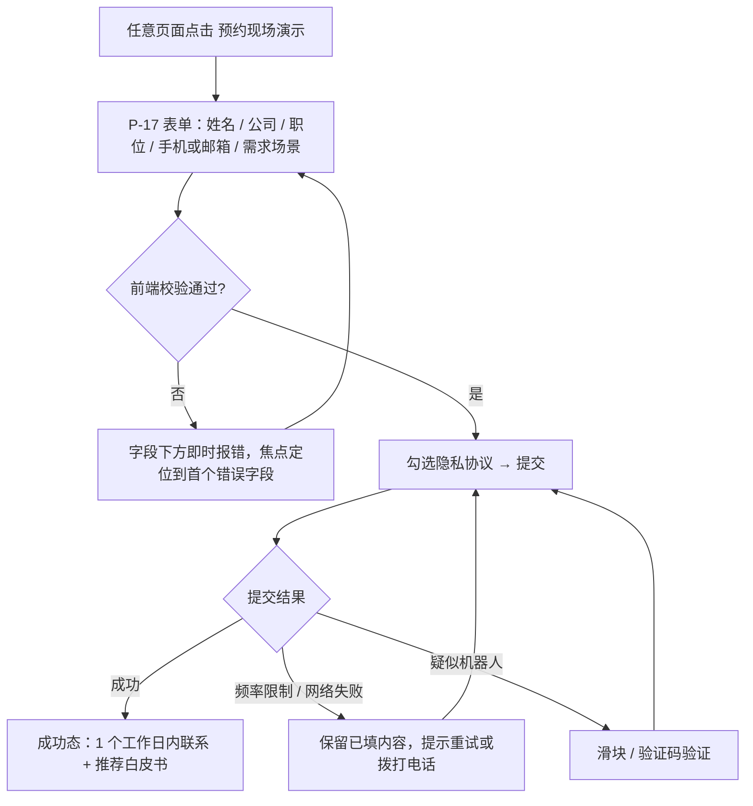
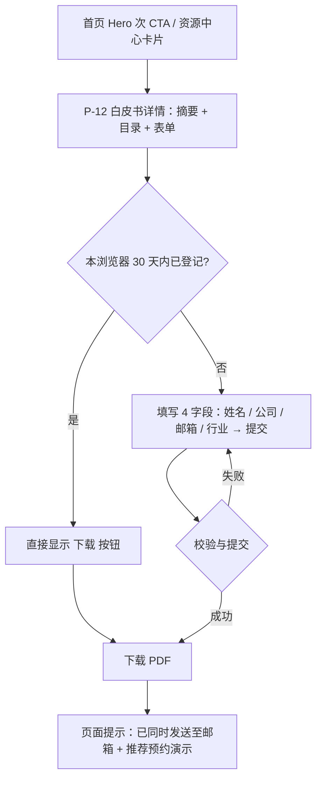
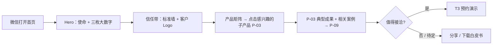

# K-02 网站 UX / 交互设计师：信息架构与可用性

> 组别：K-A 网站设计类 ｜ 版本 v0.1 ｜ 2026-10-08
> 输入变量：
> - **{网站需求}**：华云智联官网 V2.0（[README 项目基线](./README.md#2-项目基线所有文档共用)、[01 内容呈现与布局](./01-content-and-layout.md)）
> - **{目标用户}**：工业企业决策者、技术负责人、招采人员、合作伙伴、海外客户、求职者
> - **{可用性目标}**：核心任务成功率 ≥ 90%；SUS ≥ 75；预约演示表单完成 ≤ 4 步

---

## 1. 用户研究摘要

### 1.1 用户角色（Persona）

| 编号 | 角色 | 典型身份 | 来官网的目的 | 关注点 | 决策影响 |
|---|---|---|---|---|---|
| U1 | 企业决策者 | 集团 / 厂长 / CIO / CTO | 判断是否值得接洽 | 权威背书、同行业案例、投入产出 | 拍板 |
| U2 | 技术负责人 | 总工、自动化部长、设备部长 | 评估技术可行性 | 能否对接现有 PLC / DCS、部署方式、数据安全、指标口径 | 强影响 |
| U3 | 一线工程负责人 | 车间主任、巡检班组长 | 了解能否减轻现场负担 | 操作简单、现场案例、人员替代 | 使用者 |
| U4 | 招采 / 评标人员 | 采购部、招标代理 | 核实资质与规格 | 标准参编证明、资质证书、技术规格书 | 门槛 |
| U5 | 合作伙伴 / 渠道 | 集成商、设备厂商 | 寻找合作机会 | 生态合作方式、联系方式 | 中 |
| U6 | 海外客户 | 如中东、欧洲化工与能源企业 | 了解能力与国际标准地位 | 英文内容、国际标准、全球案例 | 拍板 / 强影响 |
| U7 | 求职者 | 算法、工程、销售人才 | 了解公司与岗位 | 技术实力、岗位、投递方式 | 低 |

> 依据：research/05 中的客户结构（央企、国际化工与能源企业）和 B 端采购链路。上线前建议对 U1、U2、U4 各访谈 2 人做验证【待确认】。

### 1.2 核心任务与场景清单

| 任务 | 角色 | 场景 | 优先级 |
|---|---|---|---|
| T1 判断是否值得接洽 | U1 | 收到同行推荐链接（常在微信内打开），3 分钟内判断 | P0 |
| T2 评估产品能否接入现有系统 | U2 | 方案比选阶段，查找运维之弈的接入方式与规格书 | P0 |
| T3 预约现场演示 | U1、U2 | 判断值得接洽后提交需求 | P0 |
| T4 下载技术白皮书 | U2、U4 | 内部汇报需要材料 | P0 |
| T5 核实标准与资质 | U4、U6 | 招标资格审查 | P1 |
| T6 查找同行业案例 | U1、U2 | 找油气行业落地证据 | P0 |
| T7 英文访问并联系 | U6 | 海外客户访问英文站 | P1 |
| T8 查找在招岗位 | U7 | 求职 | P2 |

---

## 2. 信息架构

### 2.1 站点地图与页面编号

| 层级 1（导航） | 层级 2 | 层级 3 | 页面编号 |
|---|---|---|---|
| 首页 | — | — | P-01 |
| 产品与技术 | SpatiGo™ 空间群弈 总览 | — | P-02 |
| | 质量之弈 / 运维之弈 / 安全之弈 / 具身之弈 | — | P-03（模板 ×4） |
| | 技术架构 | — | P-04 |
| | 模型与部署 | — | P-05 |
| 解决方案 | 解决方案总览 | — | P-06 |
| | 按行业：油气 / 化工 / 航空航天 / 烟草 / 煤炭能源 | — | P-07（模板 ×5） |
| 客户案例 | 案例列表（行业 / 产品筛选） | 案例详情 | P-08 / P-09 |
| 标准与研究 | 标准与研究 | — | P-10 |
| 资源中心 | 白皮书与文档 | 白皮书下载 | P-11 / P-12 |
| | 新闻动态 | 新闻详情 | P-13 / P-14 |
| 关于我们 | 公司介绍 / 加入我们 / 联系我们·预约演示 | — | P-15 / P-16 / P-17 |
| （功能页） | 搜索结果、404 / 500、隐私政策与法律声明 | — | P-18 / P-19 / P-20 |

- **导航深度**：所有内容页 ≤ 3 级，满足"不超过 3 级"的要求，无超限页面。
- **一级导航 6 项**：产品与技术 · 解决方案 · 客户案例 · 标准与研究 · 资源中心 · 关于我们。
- **全局工具**：搜索、中 / EN、预约现场演示（主 CTA），以及右下角悬浮咨询。
- **横向链接**：产品页 ↔ 相关案例 ↔ 行业方案 ↔ 相关标准形成互链，每个详情页底部至少 2 个相关推荐。
- **英文站**：P0 范围为 P-01、P-02、P-03、P-09（精选案例）、P-10、P-15、P-17，其余页面 P1 补齐；路由前缀 `/en/`。

### 2.2 URL 规范

| 页面 | 中文路由 | 英文路由 |
|---|---|---|
| P-03 | `/products/spatigo/quality` 等 | `/en/products/spatigo/quality` |
| P-07 | `/solutions/oil-gas` 等 | `/en/solutions/oil-gas` |
| P-09 | `/cases/<slug>` | `/en/cases/<slug>` |
| P-12 | `/resources/whitepapers/<slug>` | `/en/resources/whitepapers/<slug>` |
| P-14 | `/news/<yyyy>/<slug>` | `/en/news/<yyyy>/<slug>` |

> slug 使用英文短语（不使用拼音或数字 ID），以利 SEO 和分享。

---

## 3. 关键任务流程

### 3.1 T3 预约现场演示（目标 ≤ 4 步）

步数：①点击 CTA → ②填写 → ③勾选并提交 → ④看到成功态 = **4 步**。

### 3.2 T4 下载技术白皮书（目标 ≤ 4 步，回访用户 2 步）

### 3.3 T1 判断是否值得接洽（目标 ≤ 3 次点击，≤ 3 分钟）

### 3.4 T2 评估接入能力（目标 ≤ 4 次点击）
首页 → 产品矩阵"运维之弈"→ P-03 "部署方式与系统接入"区块（说明 PLC / DCS 接入，不改现有控制逻辑）→ 展开"技术规格"或下载规格书 PDF。
异常分支：信息不足 → 区块内"向工程师提问"入口进入 T3 表单（需求字段预填"运维之弈 · 系统接入咨询"）。

### 3.5 T6 查找同行业案例（目标 ≤ 3 次点击）
导航"客户案例"→ 行业筛选"油气"→ 案例详情。异常分支：筛选无结果 → 空态展示"该行业案例整理中"+ 相近行业案例 + 预约演示入口。

### 3.6 任务步数目标汇总

| 任务 | 目标步数 / 点击 | 目标时长（中位数） |
|---|---|---|
| T1 判断是否接洽 | ≤ 3 次点击 | ≤ 180 s |
| T2 评估接入能力 | ≤ 4 次点击 | ≤ 120 s |
| T3 预约演示 | ≤ 4 步 | ≤ 90 s |
| T4 下载白皮书 | ≤ 4 步（回访 2 步） | ≤ 60 s |
| T5 核实标准 | ≤ 2 次点击 | ≤ 45 s |
| T6 同行业案例 | ≤ 3 次点击 | ≤ 60 s |
| T7 英文联系 | ≤ 3 次点击 | ≤ 60 s |

---

## 4. 线框图 / 原型页面要素表

| 页面 | 区块 | 组件 | 交互说明 |
|---|---|---|---|
| P-01 | 公告条 | AnnouncementBar | 点击进入详情；关闭后 7 天不显示（本地存储） |
| P-01 | Hero | Header（透明态）、VideoHero、Button×2 | 视频静音循环，左下角暂停按钮；滚动超过 80px 后页头变为实色 |
| P-01 | 大数字 | Stat×3 | 进入视口时计数一次；脚注编号锚点跳到页底口径说明 |
| P-01 | 信任带 | StandardCard×4、LogoWall | 标准卡点击进入 P-10 对应锚点；Logo 悬停还原彩色，不可点击 |
| P-01 | 产品矩阵 | ProductCard×4 | 整卡可点击进入 P-03；移动端横滑并显示进度点 |
| P-01 | 现场证据 | Tab、VideoHero、Stat、Button | Tab 切换案例（键盘左右键）；视频不自动带声音 |
| P-01 | 技术架构 | ArchDiagram | 悬停 / 点击层级显示说明面板；移动端为手风琴 |
| P-01 | 行业方案 | Tab（≤6） | 每 Tab：痛点 3 条 + 方案 1 句 + 案例链接 |
| P-01 | 资源 / 新闻 | ResourceCard×3、NewsCard×3 | 卡片整体可点击 |
| P-01 | 收尾 CTA | Button | 进入 P-17 |
| P-03 | 子产品 Hero | 面包屑、H1、价值句、主 CTA | CTA 进入 P-17 并预填产品 |
| P-03 | 能力 / 原理 / 成果 | 卡片、流程图、Stat | — |
| P-03 | 部署与接入 | 表格、Accordion | 规格默认折叠，展开状态写入 URL hash 便于分享 |
| P-03 | 规格书 | Button（下载） | 直接下载（不设表单门槛，方便招采人员） |
| P-08 | 筛选 + 列表 | 筛选器（行业 / 产品）、CaseCard、Pagination | 筛选写入 URL 查询参数；骨架屏加载；空态 |
| P-10 | 标准总览 | Stat、StandardCard、表格（筛选：国际 / 国家 / 行业、角色、阶段） | 表格移动端卡片化 |
| P-12 | 详情 + 表单 | 摘要、目录、LeadForm | 见流程 3.2 |
| P-17 | 表单 + 联系方式 | LeadForm、地址、电话、地图 | 见流程 3.1；移动端电话可一键拨打 |
| P-18 | 搜索 | SearchBox、结果列表（按类型分组） | 关键词高亮；无结果推荐热门入口 |
| 全局 | 页头 | Header、NavDropdown、MobileNav、语言切换 | 下拉悬停 150ms 延迟打开；键盘 Enter / Space 打开、Esc 关闭；语言切换跳转到对应语种的同一页面（无对应页时跳到英文首页并提示） |
| 全局 | 悬浮咨询 | FloatingCTA | 首屏不显示，滚动超过 1 屏后出现 |

> 低保真线框在 Figma `06 交互说明` 页按上表逐页绘制，每个交互用编号注释，并与本表编号一致。

---

## 5. 可用性测试方案

| 项 | 内容 |
|---|---|
| 轮次 | R1：可点击线框原型（T0+W3）；R2：高保真原型（T0+W6）；R3：上线后 30 天线上复测（T0+W16） |
| 样本量 | 每轮 **8 人**：U1 ×2、U2 ×3、U4 ×1、U6 ×1（英文）、U3 ×1；8 人可发现大部分可用性问题，并支撑成功率和时长的统计 |
| 方式 | 远程有主持测试（腾讯会议录屏）+ 有声思维；移动任务在受试者手机微信内完成 |
| 设备 | PC 4 人 + 移动 4 人 |

### 5.1 测试任务

| 任务 | 任务描述（给受试者） | 成功标准 | 时长上限 |
|---|---|---|---|
| T1 | "你是某油田的设备部长，同事发来这个链接。请判断这家公司有没有在油气现场落地过。" | 找到并说出 1 个油气案例的成果 | 180 s |
| T2 | "请确认运维之弈能否接入你们现有的 DCS，并拿到技术规格。" | 到达 P-03 接入区块并下载或展开规格 | 120 s |
| T3 | "请预约一次现场演示。" | 成功态出现 | 90 s |
| T4 | "请下载一份技术白皮书。" | PDF 下载开始 | 60 s |
| T5 | "请找到这家公司主编的国际标准名称。" | 说出至少 1 个标准号 | 45 s |
| T7 | （英文）"Find how to contact the company." | 到达英文联系页 | 60 s |

### 5.2 SUS 评分计划
- 每轮测试结束后填写 **SUS 10 题标准量表**（中文版，5 点李克特）。
- 计分：奇数题 (得分 − 1)、偶数题 (5 − 得分)，求和 × 2.5，范围 0—100。
- 目标：R2 ≥ 75，R3 ≥ 78；行业平均约 68。
- 同时记录每任务后的单题难易度（SEQ，7 点）。

---

## 6. 验收指标

### 6.1 目标值

| 指标 | 定义 / 统计口径 | 目标值 |
|---|---|---|
| 任务成功率 | 在时长上限内无提示完成的人数 / 样本数，按任务计 | 每任务 ≥ 87.5%（8 人中 ≥ 7 人），P0 任务均值 ≥ 90% |
| 平均完成时长 | 成功者的完成时长中位数（失败者不计入，单独报告） | ≤ §3.6 目标时长 |
| 错误次数 | 偏离最优路径的点击（含返回）+ 表单校验报错次数，按人均计 | 人均 ≤ 1 次 / 任务 |
| SUS | 见 §5.2 | R2 ≥ 75 |
| 线上指标（R3） | 预约演示表单完成率 = 提交成功数 / 表单页访问数 | ≥ 25% |

### 6.2 实测记录表（模板）

| 轮次 | 任务 | 受试者 | 角色 | 终端 | 是否成功 | 时长（s） | 错误次数 | SEQ | 问题描述 | 严重度 |
|---|---|---|---|---|---|---|---|---|---|---|
| R1 | T1 | S01 | U2 | 移动 | 是 / 否 | | | | | 阻断 / 严重 / 一般 |

### 6.3 汇总表（模板）

| 任务 | 成功率 | 时长中位数 | 人均错误 | SEQ 均值 | 是否达标 |
|---|---|---|---|---|---|
| T1 | | | | | |
| … | | | | | |
| **SUS** | — | — | — | — | |

**问题处理规则**：阻断级问题必须在下一轮前修复；严重问题由 UX 与产品共同决定修复版本；一般问题进入迭代池。
