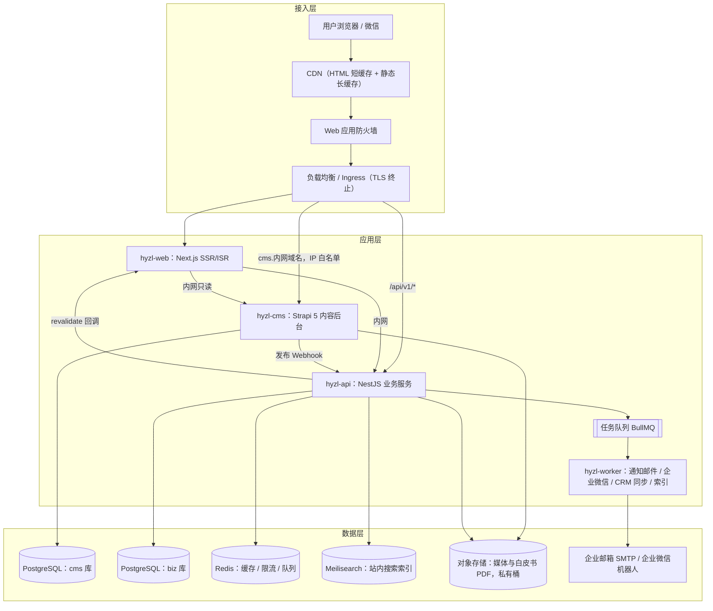
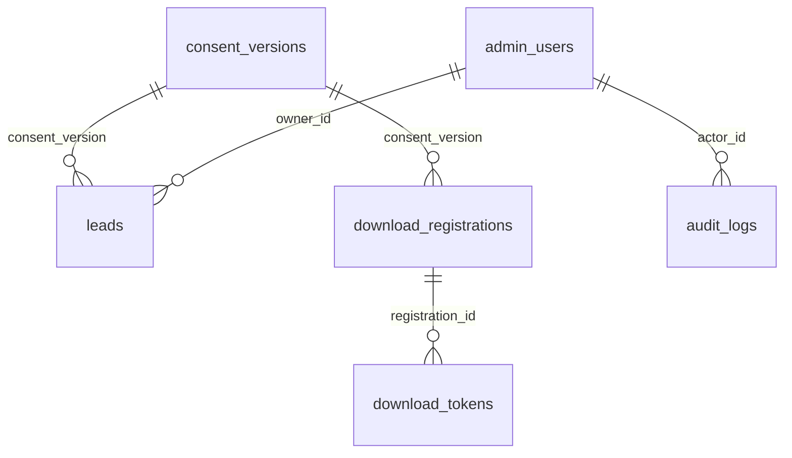

# K-05 后端开发工程师：接口与数据设计

> 组别：K-B 网站开发类 ｜ 版本 v0.1 ｜ 2026-10-08
> 输入变量：
> - **{业务需求}**：内容管理（产品、方案、案例、标准、资源、新闻、岗位、页面）；线索收集（预约演示 / 联系）；白皮书登记下载；站内搜索；前端性能 RUM 上报；ISR 刷新
> - **{并发与数据规模}**：日均 PV 3,000—10,000（页面经 CDN 缓存）；动态接口峰值 50 QPS，压测目标 200 QPS；内容 ≤ 2,000 条；线索 ≤ 5 万条 / 年；RUM ≤ 50 万条 / 日
> - **{技术栈约束}**：中国内地部署；数据不出境；容器化；与前端共享 TypeScript 校验规则

---

## 1. 架构框图



### 1.1 模块清单

| 服务 / 模块 | 技术 | 职责 |
|---|---|---|
| hyzl-web | Next.js 16（见 K-04） | 页面渲染、ISR、`/api/revalidate`、`/api/health` |
| hyzl-cms | Strapi 5（Node 24）+ PostgreSQL | 内容建模、编辑、审核发布、中英文多语言、媒体管理 |
| hyzl-api · `lead` | NestJS 11 + Prisma 6 | 预约演示 / 联系 / 合作线索的接收、去重、分配、通知 |
| hyzl-api · `download` | 同上 | 白皮书登记、签发临时下载链接、下载统计 |
| hyzl-api · `search` | 同上 + Meilisearch 1.x | 搜索查询代理、索引同步（CMS Webhook 触发） |
| hyzl-api · `rum` | 同上 | 前端 Web Vitals 批量接收、采样、写入分区表 |
| hyzl-api · `webhook` | 同上 | CMS 事件验签、幂等处理、触发 revalidate 与重建索引 |
| hyzl-api · `admin` | 同上 | 线索管理后台接口（列表、导出、状态流转），RBAC |
| hyzl-worker | NestJS standalone + BullMQ | 异步任务：通知、CRM 同步【待确认 CRM 系统】、索引重建、数据清理 |
| 数据存储 | PostgreSQL 17、Redis 7、Meilisearch 1.x、对象存储（OSS / COS / OBS，私有桶） | 见 §3 |

---

## 2. API 设计表

**约定**：RESTful；前缀 `/api/v1`；JSON（UTF-8）；时间为 ISO 8601（UTC 存储，前端按 Asia/Shanghai 展示）；每个响应带 `X-Request-Id`。

**统一错误体**：

```json
{ "code": "VALIDATION_FAILED", "message": "手机号格式不正确", "requestId": "req_7f3c...", "details": [{ "field": "phone", "rule": "format" }] }
```

### 2.1 公开接口

| 端点 | 方法 | 请求 | 响应（成功） | 错误码 | 限流策略 |
|---|---|---|---|---|---|
| `/api/v1/leads` | POST | `{ type: "demo"\|"contact"\|"partner", name, company, title?, phone?, email?, industry?, product?, scenario?(≤500 字), locale, sourcePage, utm?: {source,medium,campaign}, consentVersion, captchaTicket? }`；手机号和邮箱至少一项 | `201 { id, status: "received" }`；24 小时内同一手机 / 邮箱重复提交返回 `200` 和已有 `id`（幂等） | 400 `VALIDATION_FAILED`；422 `CAPTCHA_REQUIRED` / `CAPTCHA_INVALID`；429 `RATE_LIMITED` | 每 IP 5 次 / 10 分钟；每手机号 3 次 / 天；超阈值要求验证码 |
| `/api/v1/downloads` | POST | `{ resourceSlug, name, company, email, industry, locale, consentVersion, captchaTicket? }` | `201 { downloadToken, expiresAt }` + `Set-Cookie: dl_reg`（HttpOnly，30 天） | 400；404 `RESOURCE_NOT_FOUND`；422；429 | 每 IP 10 次 / 10 分钟 |
| `/api/v1/downloads/status` | GET | `?resource=<slug>`（携带 Cookie） | `200 { registered: boolean }` | 404 | 每 IP 60 次 / 分钟 |
| `/api/v1/downloads/{token}` | GET | — | `302` 跳转到对象存储签名 URL（有效 10 分钟） | 404 `TOKEN_NOT_FOUND`；410 `TOKEN_EXPIRED` | 每 token 5 次 |
| `/api/v1/search` | GET | `?q=`（1—50 字）`&type=product\|case\|news\|resource\|standard&locale=zh\|en&page=1&size=10` | `200 { total, hits: [{ type, title, snippet(高亮), url }], page }` | 400 | 每 IP 30 次 / 分钟；结果缓存 60 秒 |
| `/api/v1/rum` | POST | `{ items: [{ name: "LCP"\|"INP"\|"CLS"\|"TTFB", value, rating, path, device, connection, navId }] }`（≤ 20 条） | `204` | 400；413 `PAYLOAD_TOO_LARGE` | 每 IP 60 次 / 分钟；服务端按 20% 采样入库 |
| `/api/health` | GET | — | `200 { status: "ok", version }` | 503 | 不限（仅内网和探针） |
| `/api/ready` | GET | — | `200`（数据库、Redis、搜索均可用） | 503 | 同上 |

### 2.2 内部 / 管理接口

| 端点 | 方法 | 请求 | 响应 | 错误码 | 访问控制 |
|---|---|---|---|---|---|
| `/internal/webhooks/cms` | POST | Strapi Webhook 事件（`entry.publish` 等）；请求头 `X-Signature`（HMAC-SHA256） | `202` | 401 `SIGNATURE_INVALID`；409 `DUPLICATE_EVENT`（幂等） | 仅 CMS 内网 IP |
| `/admin/v1/leads` | GET | `?status=&type=&from=&to=&owner=&page=&size=` | `200 { total, items }`（手机 / 邮箱脱敏，如 `138****1234`） | 401；403 | OIDC 登录 + RBAC（销售 / 市场 / 管理员）；办公网 IP 白名单 |
| `/admin/v1/leads/{id}` | GET / PATCH | PATCH `{ status, ownerId, notes }` | `200` | 401；403；404；409 `INVALID_TRANSITION` | 查看明文需"线索管理员"角色，并写审计日志 |
| `/admin/v1/leads/export` | POST | 筛选条件 | `202 { jobId }`，异步生成带水印的 CSV | 403 | 仅管理员；单次 ≤ 5,000 条 |
| `/admin/v1/downloads/stats` | GET | `?resource=&from=&to=` | `200 { byResource, byDay }` | 403 | 市场 / 管理员 |

**线索状态机**：`new → assigned → contacted → qualified | invalid`；`invalid` 可回到 `assigned`。

### 2.3 CMS 内容接口（Strapi REST，前端只读）
`/api/home`、`/api/products`、`/api/solutions`、`/api/cases`、`/api/standards`、`/api/papers`、`/api/resources`、`/api/news`、`/api/jobs`、`/api/pages/{key}`、`/api/customer-logos`。均支持 `locale=zh|en`、`populate`、`filters`；只读 API Token 仅服务端持有。

---

## 3. 数据表设计

### 3.1 业务库（biz，PostgreSQL 17）

**leads（线索）**

| 字段 | 类型 | 约束 | 说明 |
|---|---|---|---|
| id | uuid | PK | — |
| type | varchar(16) | NOT NULL | demo / contact / partner |
| name | varchar(50) | NOT NULL | — |
| company | varchar(100) | NOT NULL | — |
| title | varchar(50) | | 职位 |
| phone_enc / email_enc | bytea | | AES-256-GCM 加密密文 |
| phone_hash / email_hash | char(64) | | HMAC-SHA256，用于去重和检索 |
| industry / product | varchar(32) | | 枚举值，来自 CMS |
| scenario | text | ≤ 500 字 | 需求描述 |
| locale | varchar(8) | NOT NULL | zh / en |
| source_page | varchar(255) | | 提交页面路径 |
| utm_source / utm_medium / utm_campaign | varchar(100) | | 渠道 |
| ip_hash | char(64) | | 不存明文 IP |
| consent_version | varchar(20) | NOT NULL, FK → consent_versions | 隐私协议版本 |
| consent_at | timestamptz | NOT NULL | — |
| status | varchar(16) | NOT NULL, 默认 new | 状态机见 §2.2 |
| owner_id | uuid | FK → admin_users | 跟进人 |
| notes | text | | 跟进备注 |
| created_at / updated_at | timestamptz | NOT NULL | — |
| deleted_at | timestamptz | | 软删除（响应用户删除请求） |

索引：`(created_at DESC)`；`(status, created_at DESC)`；`(phone_hash, created_at)`；`(email_hash, created_at)`；`(owner_id, status)`。

**download_registrations（白皮书登记）**：id (uuid, PK)、resource_slug (varchar 120, NOT NULL)、name、company、email_enc、email_hash、industry、locale、consent_version (FK)、consent_at、ip_hash、utm_*、created_at。索引 `(resource_slug, created_at)`、`(email_hash)`。

**download_tokens（下载凭证）**：id (PK)、registration_id (FK → download_registrations, ON DELETE CASCADE)、token_hash (char 64, UNIQUE)、expires_at、used_count (int, 默认 0)、last_used_at。索引 `(expires_at)`（用于清理）。

**consent_versions（隐私协议版本）**：version (PK)、content_sha256、effective_at、locale。

**admin_users（后台用户）**：id、sso_subject (UNIQUE)、display_name、role（admin / lead_manager / sales / marketing / viewer）、status、last_login_at、created_at。

**audit_logs（审计日志）**：id (bigserial)、actor_id (FK)、action（view_pii / update_status / export …）、target_type、target_id、diff (jsonb)、ip_hash、created_at。索引 `(target_type, target_id)`、`(actor_id, created_at)`；只追加，不允许更新和删除（数据库权限控制）。

**webhook_events（Webhook 幂等）**：id、source、event_id (UNIQUE)、event_type、payload_sha256、status（received / processed / failed）、retries、created_at。

**rum_metrics（性能数据，按日分区）**：id (bigserial)、metric、value (numeric)、rating、path、device、connection、created_at。按 `created_at` 范围分区，保留 90 天，由 worker 每日删除过期分区。

### 3.2 关联关系



### 3.3 CMS 内容模型（cms 库，Strapi 管理，启用 i18n）

| 内容类型 | 关键字段 | 关系 |
|---|---|---|
| Product（子产品 ×4） | name、slug、tagline、capabilities（组件）、metrics（组件：值 / 单位 / 口径脚注）、deployment、specs（富文本）、spec_pdf（媒体）、seo | ↔ Case、Solution |
| Solution（行业） | name、slug、pain_points、architecture_image、scenarios | ↔ Product、Case、Standard |
| Case | title、slug、customer_display_name、industry、challenge、solution、timeline、results（组件，至少 1 项量化）、video、authorized（布尔）、auth_doc | ↔ Product、Solution |
| Standard | code（如 IEEE P3701.1）、name、org、role（主编 / 参编 / 委员）、stage（PAR / 草案 / 已发布）、year、link | ↔ Solution |
| CustomerLogo | name、logo（SVG）、industry、**authorized**、**auth_expires_at**、sort | — |
| Resource（白皮书等） | title、slug、summary、toc、cover、file（私有桶）、gated（布尔） | — |
| News、Paper、Job | 标题、日期、正文 / 摘要、作者、标签 | — |
| Page（单例：home、about、architecture、deployment、privacy） | 动态区块（Dynamic Zone） | — |

> 规则：前端只拉取 `authorized = true` 且未过期的客户 Logo 和案例；每个量化指标的"口径脚注"为必填（落实 01 §6.3 的合规要求）。

---

## 4. 性能设计与压测

### 4.1 目标

| 接口 | 目标 QPS（压测） | P95 | P99 | 错误率 |
|---|---|---|---|---|
| `POST /leads` | 50 | ≤ 200 ms | ≤ 500 ms | < 0.1% |
| `POST /downloads` + `GET /downloads/{token}` | 50 | ≤ 200 ms | ≤ 500 ms | < 0.1% |
| `GET /search` | 100 | ≤ 150 ms | ≤ 400 ms | < 0.1% |
| `POST /rum` | 300 | ≤ 50 ms | ≤ 150 ms | < 0.5% |
| 混合场景（按线上比例） | **200** | ≤ 200 ms | ≤ 500 ms | < 0.1% |
| hyzl-web 页面（绕过 CDN 直连源站） | 100 | TTFB ≤ 300 ms | ≤ 800 ms | < 0.1% |

### 4.2 缓存策略

| 对象 | 位置 | TTL / 失效 |
|---|---|---|
| HTML 页面 | CDN + Next.js 数据缓存 | `s-maxage=60, stale-while-revalidate=600`；CMS 发布时按标签失效 |
| 静态资源 | CDN | 1 年，文件名带哈希 |
| CMS API 响应 | Next.js fetch 缓存（按 tag） | Webhook 失效 |
| 搜索结果 | Redis | 60 s，CMS 发布时清空 `search:*` |
| 限流计数 | Redis | 滑动窗口 |
| 下载登记状态 | HttpOnly Cookie + Redis | 30 天 |

### 4.3 压测方案
- **工具**：k6（脚本放在仓库 `perf/`），从同地域独立压测机发起。
- **环境**：预发环境，配置与生产 1:1（副本数、规格、数据量：模拟 5 万条线索）。
- **场景**：①基准：每接口 10 QPS，持续 5 分钟；②负载：爬坡到目标 QPS 并保持 15 分钟；③峰值：混合 200 QPS 保持 10 分钟；④稳定性：混合 100 QPS 保持 2 小时；⑤限流验证：单 IP 超阈值，确认返回 429。
- **通过标准**：满足 §4.1；CPU < 70%，数据库连接池使用率 < 80%，无内存持续增长。
- **外部依赖**：验证码校验和邮件发送使用桩服务（mock），避免压测触发真实通知。

### 4.4 压测结果表（模板）

| 场景 | 接口 | 目标 QPS | 实测 QPS | P95 | P99 | 错误率 | CPU 峰值 | 数据库连接峰值 | 结论 |
|---|---|---|---|---|---|---|---|---|---|
| ③ 峰值 | 混合 | 200 | | | | | | | 通过 / 不通过 |

---

## 5. 安全措施清单

| 类别 | 措施 |
|---|---|
| 鉴权 | 后台使用 OIDC 单点登录（企业微信 / 钉钉 / 飞书之一【待确认】）+ RBAC；会话 8 小时；管理接口限办公网 IP；CMS 后台强制 MFA |
| 服务间认证 | web → CMS 用只读 API Token；CMS → api 的 Webhook 用 HMAC-SHA256 签名 + 时间戳（5 分钟窗口）+ event_id 幂等 |
| 参数校验 | 全部入参用 DTO 白名单（Zod / class-validator），拒绝未知字段；长度、枚举、格式校验与前端共享规则 |
| 防注入 | Prisma 参数化查询，禁止拼接 SQL；搜索关键词转义后再交给 Meilisearch |
| XSS | CMS 富文本在服务端用 DOMPurify 白名单清洗；前端默认转义；CSP：`default-src 'self'`，脚本使用 nonce |
| CSRF | 公开 POST 校验 `Origin` / `Referer` 与站点域名；Cookie `SameSite=Lax; Secure; HttpOnly` |
| 防刷 | Redis 限流（§2）+ 风险触发式验证码（云厂商验证码服务）+ WAF 规则（Bot 管理、CC 防护） |
| 敏感数据加密 | 手机号和邮箱字段级 AES-256-GCM 加密，密钥由云 KMS 托管、每年轮换；检索用 HMAC 哈希；后台默认脱敏，查看明文写审计日志 |
| 传输安全 | 全站 HTTPS（TLS 1.2+），HSTS `max-age=31536000` |
| 下载保护 | 白皮书存私有桶，只签发 10 分钟有效的临时 URL；token 只存哈希 |
| 日志脱敏 | 日志中不记录手机号、邮箱、IP 明文；请求体按字段白名单输出 |
| 个人信息保护（《个人信息保护法》） | 表单处展示隐私政策链接并记录同意版本；线索保留期限【待确认，建议 3 年】，到期自动删除；支持删除请求（软删除后 30 天内物理删除）；数据存储在境内 |
| 依赖与镜像 | CI 中执行 `pnpm audit`、容器镜像漏洞扫描；高危漏洞阻断发布 |
| 合规 | 网站按等保 2.0 二级要求建设【待确认是否需要定级备案】 |

---

## 6. 交付清单

| 交付物 | 内容 |
|---|---|
| API 文档 | OpenAPI 3.1（`apps/api/openapi.yaml`，由 NestJS Swagger 生成并人工校对）；测试环境提供 Swagger UI（需登录） |
| 数据库 | Prisma schema 与迁移脚本（`prisma/migrations`）；初始数据（consent_versions、枚举）；ER 图 |
| CMS | Strapi 内容类型定义（`src/api/*/content-types`），可随代码迁移；角色权限配置导出 |
| 部署配置 | Dockerfile（api、worker、cms）；Helm Chart / docker-compose（测试环境）；环境变量清单（`DATABASE_URL`、`REDIS_URL`、`MEILI_URL`、`MEILI_KEY`、`OSS_*`、`KMS_KEY_ID`、`HMAC_SECRET`、`WEBHOOK_SECRET`、`CAPTCHA_*`、`SMTP_*`、`OIDC_*`） |
| 日志规范 | JSON 结构化日志，字段：`ts`、`level`、`service`、`requestId`、`traceId`、`route`、`status`、`latencyMs`、`errorCode`（不含个人信息） |
| 监控埋点 | Prometheus 指标：`http_requests_total{route,status}`、`http_request_duration_seconds`（直方图）、`leads_created_total{type}`、`downloads_total{resource}`、`captcha_challenges_total`、`rate_limited_total{route}`、`queue_jobs_failed_total`、`webhook_events_total{status}`；OpenTelemetry 链路：入口请求 → 数据库 → Redis → 外部调用（与 K-07 §4 对齐） |
| 测试 | 单元测试覆盖率 ≥ 80%（service 层）；接口集成测试（Testcontainers）；k6 脚本 |
