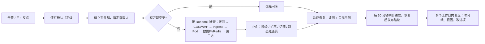

# K-07 网站运维工程师（SRE）：部署、监控与应急

> 组别：K-C 网站运维类 ｜ 版本 v0.1 ｜ 2026-10-08
> 输入变量：
> - **{网站系统}**：hyzl-web（Next.js）、hyzl-api / hyzl-worker（NestJS）、hyzl-cms（Strapi）、PostgreSQL、Redis、Meilisearch、对象存储、CDN、WAF（架构见 K-05 §1）
> - **{可用性目标}**：对外页面月可用性 99.9%；线索提交成功率 99.9%
> - **{流量规模}**：日均 PV 3,000—10,000；展会 / 发布会峰值 10 倍；动态接口峰值 50 QPS（压测容量 200 QPS）

---

## 1. 部署方案

### 1.1 基础设施（中国内地，单地域双可用区）【待确认云厂商】

| 组件 | 形态 | 规格建议（起步） |
|---|---|---|
| 容器平台 | 托管 Kubernetes（ACK / TKE / CCE） | 3 个工作节点 4C8G，跨 2 个可用区 |
| PostgreSQL 17 | 云数据库，主备高可用，cms 与 biz 两个库 | 2C4G，100 GB SSD，自动备份 |
| Redis 7 | 云 Redis 主备 | 1 GB |
| Meilisearch | 集群内 StatefulSet + 云盘 | 1C2G，20 GB |
| 对象存储 | 公共读桶（媒体）+ 私有桶（白皮书），开启版本控制 | — |
| CDN + WAF + 负载均衡 | 云服务 | HTTPS 证书自动续期 |
| 镜像仓库 | 云容器镜像服务 | 开启镜像漏洞扫描 |

### 1.2 环境划分

| 环境 | 用途 | 域名（示例） | 数据 | 部署触发 |
|---|---|---|---|---|
| 开发 dev | 开发联调 | 本地 docker-compose | 假数据 | 开发者本地 |
| 测试 test | K-06 功能测试、K-03 走查 | `test.huayunzhilian.cn`（仅办公网） | 脱敏样例数据 | 合并到 `develop` 自动部署 |
| 预发 staging | 压测、上线前验证 | `staging.huayunzhilian.cn`（仅办公网） | 生产内容副本（不含线索个人信息） | 打 `rc` tag 自动部署 |
| 生产 prod | 对外服务 | `www.huayunzhilian.cn` | 真实数据 | 打正式 tag + 人工审批 |

> CMS 内容在生产环境编辑；测试和预发环境通过每周定时脚本同步内容（剔除线索等个人信息）。

### 1.3 发布策略

| 服务 | 策略 | 说明 |
|---|---|---|
| hyzl-web、hyzl-api | **灰度（金丝雀）** | Ingress 按权重分流：5%（观察 15 分钟）→ 25%（15 分钟）→ 100%；每一步自动检查错误率、P95 时延和 LCP，超阈值自动停止 |
| hyzl-worker | 滚动 | `maxUnavailable=0`，任务幂等 |
| hyzl-cms | 滚动 + 维护窗口 | 涉及数据库结构变更时在工作日 21:00—23:00 执行，提前通知内容编辑 |
| 数据库迁移 | 扩展—收缩（expand / contract） | 先加字段和表并保持向后兼容，旧代码全部下线后再删除旧字段；迁移脚本必须可重复执行 |
| 静态资源 | 先发布 | 新版 `/_next/static` 先上传 CDN 源站，再切换应用，避免新旧版本资源 404 |

**发布流水线（GitHub Actions）**：lint / 单元测试 → 构建镜像 → 镜像扫描 → Lighthouse CI + Playwright 冒烟 → 推送镜像 → 部署 test → （打 rc tag）→ staging + 压测（按需）→ 人工审批 → prod 灰度。
**发布窗口**：工作日 10:00—16:00；节假日前一天和重大活动前 48 小时封版（紧急修复除外）。

### 1.4 回滚方案

| 场景 | 回滚操作 | 目标时长 |
|---|---|---|
| 灰度阶段指标异常 | 自动将权重切回 0%，删除新版本 | ≤ 2 分钟 |
| 全量后发现问题 | `helm rollback` 到上一个版本（镜像 tag 不可变）+ 触发全量 revalidate + CDN 刷新 | ≤ 10 分钟 |
| 数据库迁移问题 | 由于采用扩展—收缩，应用回滚不需要回滚数据库；数据损坏时按时间点恢复（PITR）到新实例后切换 | ≤ 60 分钟 |
| CMS 内容误发布 | CMS 版本历史回退 + revalidate | ≤ 5 分钟 |

---

## 2. 监控指标体系

### 2.1 指标（四个黄金信号 + 业务指标）

| 类别 | 指标 | 采集方式 |
|---|---|---|
| 可用性 | 拨测成功率（P-01、P-03、P-12、P-17、`/api/health`），全国 6 个以上城市、3 家运营商，每分钟 1 次 | 云拨测 / blackbox_exporter |
| 响应时间 | 拨测首字节时间（TTFB）、首页完整加载时间；接口 P95 / P99（`http_request_duration_seconds`） | 拨测 + Prometheus |
| 错误率 | HTTP 5xx 比例（按服务、路由）；前端 JS 错误数（Sentry）；表单提交失败率 | Prometheus、Sentry |
| 饱和度 | CPU、内存、Pod 重启次数；数据库连接数 / CPU / 慢查询；Redis 内存；磁盘；队列积压 | Prometheus、云监控 |
| 用户体验 | RUM：LCP / INP / CLS 的 P75（按页面、设备） | `/api/v1/rum` → Grafana |
| 业务 | 每小时线索数、下载数、验证码触发数、限流次数；CDN 命中率 | Prometheus、CDN 日志 |
| 证书与域名 | 证书剩余天数、域名到期、ICP 备案状态 | 定时检查 |

### 2.2 告警规则表

| 指标 | 阈值 | 级别 | 通知人 / 方式 |
|---|---|---|---|
| 首页拨测失败 | 连续 3 分钟，≥ 2 个城市失败 | P1 紧急 | 值班 SRE（电话 + 企业微信）、后端负责人 |
| `/api/health` 拨测失败 | 连续 3 分钟 | P1 | 值班 SRE、后端负责人 |
| 线索提交 5xx 比例 | > 1%，持续 5 分钟 | P1 | 值班 SRE、后端负责人、市场负责人（知会） |
| 全站 5xx 比例 | > 0.5%，持续 5 分钟 | P2 重要 | 值班 SRE（企业微信） |
| 接口 P95 | > 500 ms，持续 10 分钟 | P2 | 值班 SRE、后端 |
| RUM LCP P75（移动） | > 3.0 s，持续 1 小时 | P3 一般 | 前端负责人（企业微信群） |
| Pod 重启 | 15 分钟内 > 3 次 | P2 | 值班 SRE |
| 节点 / 数据库 CPU | > 80%，持续 15 分钟 | P2 | 值班 SRE |
| 数据库连接使用率 | > 80% | P2 | 值班 SRE、后端 |
| 队列积压 | > 500 个任务，或失败任务 > 10 个 / 小时 | P3 | 后端 |
| 错误预算消耗速率 | 1 小时消耗 > 2%（快速燃烧） | P1 | 值班 SRE |
| 错误预算消耗速率 | 6 小时消耗 > 5%（慢速燃烧） | P2 | 值班 SRE |
| 证书剩余天数 | < 21 天 | P3 | SRE |
| 线索数异常 | 工作日 4 小时内为 0，或 1 小时内 > 50 条（疑似刷单） | P3 | 市场负责人、SRE |
| 备份失败 | 任意一次 | P2 | SRE |

> 告警必须附 Runbook 链接；P1 告警 5 分钟未确认时升级到 SRE 负责人。

---

## 3. SLO 定义

| SLI | 测量方法 | SLO（滚动 30 天） | 错误预算 |
|---|---|---|---|
| 页面可用性 | 拨测成功次数 / 总拨测次数（P-01、P-03、P-12、P-17） | **99.9%** | 43.2 分钟 / 30 天 |
| 线索提交成功率 | 提交成功（2xx）/（2xx + 5xx + 超时）；4xx 业务校验失败不计入 | **99.9%** | 每 1,000 次提交允许 1 次失败 |
| 页面时延 | 拨测 TTFB ≤ 800 ms 的比例 | 99% | 1% |
| 前端体验 | 移动端 LCP ≤ 2.5 s 的页面访问比例（RUM） | 75%（即 P75 达标） | — |

**错误预算消耗规则**

| 当期消耗 | 动作 |
|---|---|
| < 50% | 正常发布 |
| 50%—100% | 只允许低风险发布；每次发布前复核回滚方案；SRE 周报说明原因 |
| > 100% | 冻结功能发布，只允许稳定性修复，直至滚动窗口恢复；召开复盘会 |
| 单次事件消耗 > 20% | 必须写事故复盘报告（5 个工作日内） |

---

## 4. 日志与链路

### 4.1 日志采集规范

| 项 | 规范 |
|---|---|
| 格式 | JSON 单行，UTF-8 |
| 必填字段 | `ts`（ISO 8601）、`level`、`service`、`env`、`version`、`requestId`、`traceId`、`spanId`、`route`、`method`、`status`、`latencyMs` |
| 可选字段 | `errorCode`、`errorStack`（仅 error 级）、`userRole`（后台） |
| 禁止内容 | 手机号、邮箱、姓名、明文 IP、Cookie、Token、请求体原文 |
| 级别 | 生产默认 info；debug 只能临时开启且自动 2 小时后恢复 |
| 采集 | 容器标准输出 → Loki（或云日志服务）；Nginx / Ingress 访问日志、CDN 日志、WAF 日志同步采集 |
| 保留 | 应用和访问日志 **≥ 180 天**（满足《网络安全法》网络日志留存不少于六个月的要求）；审计日志（audit_logs）≥ 3 年 |
| 权限 | 日志平台按角色授权；导出操作留痕 |

### 4.2 链路追踪埋点清单（OpenTelemetry，采样率：错误 100%，正常 10%）

| 服务 | 埋点位置（Span） | 关键属性 |
|---|---|---|
| hyzl-web | 页面请求入口、CMS fetch、业务 API 调用、`/api/revalidate` | `route`、`cache.hit`、`locale` |
| hyzl-api | HTTP 入口、验证码校验、数据库查询（Prisma）、Redis、Meilisearch、对象存储签名、入队 | `route`、`db.statement`（参数化后）、`rate_limited` |
| hyzl-worker | 任务消费、邮件 / 企业微信发送、CRM 同步、索引重建 | `job.name`、`attempt`、`result` |
| hyzl-cms | Webhook 发送 | `event.type`、`event.id` |
| 前端 | `traceparent` 透传到 API（同源请求） | — |

链路后端：Tempo 或 Jaeger；Grafana 中从日志 `traceId` 一键跳转链路。

---

## 5. 应急预案

### 5.1 故障分级与响应时限

| 级别 | 定义 | 响应时限（确认） | 恢复目标 | 通报 |
|---|---|---|---|---|
| **P1 紧急** | 全站不可访问；线索 / 下载功能完全不可用；数据泄露或被篡改（含首页被篡改） | 5 分钟 | 30 分钟内恢复或降级 | 立即通知技术负责人、市场负责人；数据安全事件按法规流程上报 |
| **P2 重要** | 部分页面或功能不可用；性能严重下降（P95 > 1 s）；单可用区故障 | 15 分钟 | 2 小时 | 技术负责人 |
| **P3 一般** | 非核心功能异常；个别浏览器问题；性能轻度下降 | 1 小时（工作时间） | 1 个工作日 | 工作群 |
| **P4 提示** | 无用户影响的隐患 | 下个工作日 | 纳入迭代 | 周报 |

### 5.2 处置流程

### 5.3 常见场景 Runbook（摘要）

| 场景 | 止血措施 |
|---|---|
| 源站全部不可用 | CDN 开启"源站故障时返回缓存"；切换到对象存储托管的静态兜底页（含联系电话和邮箱） |
| hyzl-api 不可用 | 内容页不受影响；前端表单提示电话联系；worker 积压任务在恢复后重放 |
| 数据库主库故障 | 云数据库自动主备切换（≤ 60 秒）；确认应用连接池重连 |
| CC 攻击 / 刷表单 | WAF 开启严格模式与人机验证；临时调低限流阈值；封禁异常 IP 段 |
| 首页被篡改 | 立即回滚到上一版本并修改全部密钥；保留现场日志；按网络安全事件流程上报 |
| 证书过期 | 手动签发并替换；补齐自动续期监控 |
| CMS 误删内容 | 从版本历史或数据库时间点恢复 |

### 5.4 演练计划

| 演练 | 频率 | 验收标准 |
|---|---|---|
| 生产回滚演练（预发环境模拟） | 每月 1 次 | 回滚 ≤ 10 分钟 |
| 数据库时间点恢复演练 | 每季度 1 次 | RPO ≤ 15 分钟，RTO ≤ 60 分钟 |
| 源站故障切换静态兜底页 | 上线前 1 次 + 每半年 1 次 | 切换 ≤ 5 分钟 |
| 告警链路演练（电话 / 企业微信可达） | 每季度 1 次 | P1 告警 5 分钟内被确认 |
| 安全事件桌面推演 | 每年 1 次 | 流程、上报对象清晰 |

### 5.5 备份
- PostgreSQL：每日全量备份 + WAL 连续归档，支持 7 天内时间点恢复；每周异地（同城另一可用区）备份一份，保留 30 天。
- 对象存储：开启版本控制，删除的对象保留 30 天。
- Meilisearch：可由 CMS 数据重建，不单独备份；重建时间 ≤ 10 分钟。
- 配置与密钥：Helm values 进 Git（密钥除外）；密钥存云 KMS / 密钥管理服务。

---

## 6. 容量管理

### 6.1 流量增长预估

| 时间 | 日均 PV | 峰值动态 QPS | 依据 |
|---|---|---|---|
| 上线首月 | 3,000—10,000 | 50 | 项目基线 |
| 6 个月 | 1 万—2 万 | 80 | 内容营销和 SEO 收录提升【待确认市场计划】 |
| 12 个月 | 2 万—4 万 | 150 | 英文站上线、海外推广 |
| 发布会 / 展会当日 | 平日 10 倍 | 200（已压测） | K-05 §4 |

### 6.2 扩容触发条件

| 资源 | 触发条件 | 动作 |
|---|---|---|
| hyzl-web / hyzl-api Pod | CPU > 60% 或内存 > 75%，持续 5 分钟 | HPA 自动扩容，副本数 2→8 |
| 工作节点 | 集群可分配 CPU 剩余 < 30% | 节点池自动扩容 1—2 个节点 |
| PostgreSQL | CPU > 70% 持续 1 天，或存储 > 70% | 升配 / 扩容存储（提前 1 周评估） |
| Redis | 内存 > 70% | 升配 |
| CDN | 命中率 < 85% | 排查缓存头和回源规则 |
| 计划性活动 | 已知发布会 / 展会 | 提前 1 天把副本数提升到 2 倍，并预热 CDN（首页、产品页、活动页） |

### 6.3 容量评审
每月出具容量与 SLO 报告：资源水位趋势、错误预算消耗、成本、下月预测与扩容计划。
