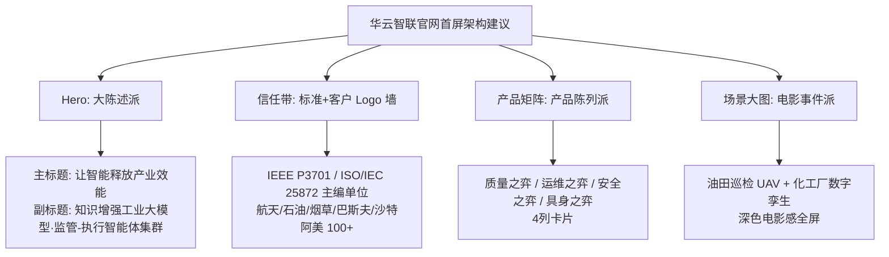
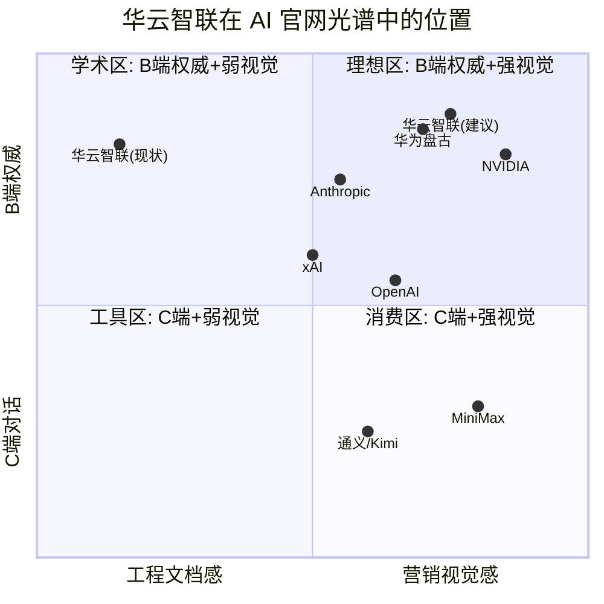

# 西安华云智联官网设计对标分析
## ——基于国内外 AI 头部企业四类首屏范式框架

> 调研对象：huayunzhilian.cn（2026-10-07 实抓 about.html / product.html / 首页 footer）
> 对标框架：大陈述派 / 对话框派 / 产品陈列派 / 电影事件派（详见前两篇）
> 定位：工业人工智能 B 端头部企业（SpatiGo™ 空间群弈™ 智能体集群）

---

## 一、华云智联官网现状诊断（基于实抓）

### 1.1 已有内容资产（极强，但被埋没在长文里）

| 资产类型 | 具体内容 | 视觉化潜力 |
|---|---|---|
| **使命句** | "让智能释放产业效能" | 可直接做大陈述 hero |
| **标准权威** | 主编 IEEE P3701/P3701.1、ISO/IEC 25872、P4123；SAC/TC124/TC28/TC88、IEC/TC65 委员；民企署名国标全国第 1 | 可做"标准墙"信任模块 |
| **头部客户** | 中国航天科技、航空工业、中国石油、中国保利、中国烟草、陕西延长石油、德国巴斯夫、沙特阿美、陕煤等 100+ | Logo 墙 + 案例数据 |
| **旗舰产品** | SpatiGo™ 四子产品：质量之弈 / 运维之弈 / 安全之弈 / 具身之弈 | 可做 4 列产品卡 |
| **具身智能素材** | 旋翼 UAV、轮式/四足/人形 UGV、CNC、PLC/DCS 闭环 | **电影事件派最佳素材** |
| **技术架构** | LLM-WM 监管-执行多智能体、HITL、"7+10+2+N"、MPC 硬约束 | 架构图（当前纯文字） |
| **量化指标** | 推荐准确度 >95%、1.3B 小模型可部署、670B↔1B-32B 迁移 | 大数字陈述 |
| **客户场景** | 长庆油田特种作业、延长石油具身智能（陕西省首批 15 个重大场景） | 案例视频/大图 |

### 1.2 现状问题

1. **首页无 hero**：抓取仅得 footer 联系信息，主体 JS 渲染或极简，无 6–10 词大陈述。
2. **about 页 = 标准履历长文**：段落式叙述，无卡片、无模块化、无视觉锚点。
3. **product 页 = 技术规格书**：大量参数表、GB/IEC/Pantone/RAL 标准号堆砌，像招标技术文件而非官网。
4. **无产品截图/数字孪生图/现场照片**：SpatiGo™、具身之弈（UAV/UGV）这种最有画面感的产品零配图。
5. **配色/字体未识别**：从抓取内容看是默认政企站白底黑字，无品牌色谱系统。
6. **文案语态**：工程第三人称（"公司提供……""应支持……"），无第二人称对话，无客户视角。

> 一句话诊断：**华云智联现在是"第五类——白皮书文档派"，内容资产是头部级，视觉表达是 2015 年政企站级。**

---

## 二、四类框架对标定位

### 2.1 四类范式 × 华云智联适配度

| 范式 | 代表 | 对华云智联适配度 | 理由 |
|---|---|---|---|
| **大陈述派** | OpenAI / Anthropic / xAI | ★★★★☆ | 有现成使命句"让智能释放产业效能"；B 端决策者（总工/厂长/客户 CTO）吃权威陈述，不吃可爱对话框 |
| **对话框派** | ChatGPT / 通义 / 文心 | ★☆☆☆☆ | **不适用**。工业客户不是来聊天的，是来看"你在油田/化工厂跑过没有、有没有国标背书" |
| **产品陈列派** | MiniMax / 智谱 / 讯飞 | ★★★★★ | SpatiGo™ 四子产品 + 7 引擎 + 10 软件天然是矩阵；当前被写成了参数表 |
| **电影事件派** | NVIDIA / 华为盘古 | ★★★★★ | **具身之弈 UAV/UGV、数字孪生、长庆油田现场、100+ 工业集团 logo 墙**——这是最被浪费的视觉资产 |

### 2.2 结论：华云智联应走"1+3"混合路线

**即：Hero 用大陈述派立权威，中页用产品陈列派摆矩阵，下页用电影事件派砸现场证据。** 这正是 NVIDIA 官网的节奏（黑底绿标 + GTC event 大图 + 产品卡），也是华为盘古（蓝底 + L0/L1/L2 架构图 + 行业大图）。

---

## 三、逐类差距对标与改造建议

### 3.1 大陈述派维度（对标 OpenAI / Anthropic）

| 要素 | OpenAI / Anthropic 做法 | 华云智联现状 | 改造建议 |
|---|---|---|---|
| Hero 标题 | 6–10 词、负字距、衬线或几何无衬线 | 无 | "让智能释放产业效能"作主标题；副标"知识增强工业大模型 × 监管-执行智能体集群" |
| 使命叙事 | OpenAI"AGI 造福全人类"；Anthropic"reliable, interpretable, steerable" | "助力传统工业企业"（太弱） | 三关键词对标：**可靠 Reliable / 标准 Standard / 可信 Trustworthy**（工业客户要的是这三个） |
| 大数字 | Anthropic 用衬线价格；NVIDIA 用 GPU 算力 | >95% 准确度、1.3B 可部署、100+ 客户埋在段落里 | 提为首屏三枚大数字：**100+ 工业集团｜4 项国际标准｜>95% 推荐准确度** |
| CTA 动词 | "Try Claude" / "Sign in" | 无 | B 端双 CTA：**"预约现场演示"（主）+ "下载白皮书"（次）** |

### 3.2 产品陈列派维度（对标 MiniMax / 智谱 GLM）

| 要素 | MiniMax / 智谱做法 | 华云智联现状 | 改造建议 |
|---|---|---|---|
| 产品卡 | 纯白底、彩色卡、圆角 12–16px、3–4 列 | 纯文字表格 | SpatiGo™ 四子产品做 4 列卡：质量之弈/SPC·CPK；运维之弈/FMEA·预测维护；安全之弈/多模态合规；具身之弈/UAV·UGV 群控 |
| 技术架构图 | DeepMind 用 tab+图表；华为用 L0/L1/L2 三层图 | "7+10+2+N"写成段落 | 画成**纵向分层图**：底层多模态数据基座 → 7 引擎 → 10 工业软件 → 2 约束（MPC 硬/成本软）→ N 智能体 |
| 模型矩阵 | Anthropic Opus/Sonnet/Haiku 对比卡 | iMoM/iMLLM/引擎群埋在文字 | 做模型能力对比表：670B 全量 ↔ 1B-32B 轻量部署区间，标注私有化/云化 |

### 3.3 电影事件派维度（对标 NVIDIA / 华为盘古）

| 要素 | NVIDIA / 华为做法 | 华云智联现状 | 改造建议 |
|---|---|---|---|
| 满幅现场图 | GPU 渲染、数据中心、行业大图 | **零配图** | 用三类真素材：① 油田/化工厂 UAV 巡检实拍；② 数字孪生 3D 大屏截图；③ UGV 四足/人形机器人作业 |
| 事件驱动 | NVIDIA GTC 常驻购票；华为云发布会 | 陕西省首批 15 个重大场景（延长石油具身智能）未上首页 | 做"场景案例带"：陕西省具身智能场景验证 + 长庆油田特种作业闭环 |
| 客户 Logo 墙 | NVIDIA 合作伙伴 logo 矩阵 | 100+ 客户名藏在 about 段尾 | 首页中部 logo 墙：航天科技/航空工业/中国石油/中国烟草/中国联通/巴斯夫/沙特阿美/陕煤/延长石油 |
| 深色电影段 | NVIDIA 纯黑 #000 + 电光绿 #76b900 | 无 | 建议工业深色段：近黑底 + **工业橙/安全红**（呼应 GB 2893 安全色），而非科技蓝紫 |

### 3.4 文案语气改造

| 现状（第三人称工程腔） | 建议（客户视角） |
|---|---|
| "公司提供……""应支持……" | "让您的油田巡检从 8 人班组降到 1 人监管" |
| "融合 IEC 61131-3 FBD/SFC/ST" | "不改您现有 PLC/DCS，智能体直接读控制逻辑" |
| "增强后数据推荐准确度高于 95%" | "1.3B 小模型跑在您的工控机上，推荐准确度 95%+" |
| "满足等保 2.0 二级" | "私有化部署，不出厂网" |

---

## 四、华云智联 vs 头部企业定位坐标

**解读**：华云智联现状落在"学术区"纵轴顶端（B 端权威性已经拉满——国际标准+央企客户），但横轴严重偏左（视觉营销弱）。改造目标是水平右移到 NVIDIA/华为盘古所在的"理想区"，**纵轴不需要动**。

---

## 五、优先级行动清单

| 优先级 | 动作 | 对标对象 |
|---|---|---|
| P0 | 首页加 hero：使命大标题 + 3 枚大数字（100+客户/4项国标/>95%）+ 双 CTA | OpenAI / Anthropic |
| P0 | 首屏下加客户 logo 墙（航天/石油/烟草/巴斯夫/沙特阿美） | NVIDIA |
| P0 | SpatiGo™ 四子产品 4 列卡片化 | MiniMax / 智谱 |
| P1 | 一段深色电影感全屏：UAV 油田巡检 or 数字孪生大屏实拍 | NVIDIA |
| P1 | "7+10+2+N" 画成纵向分层架构图 | 华为盘古 L0/L1/L2 |
| P1 | 文案第三人称改第二人称客户视角 | Anthropic |
| P2 | 建立品牌色谱：近黑工业底 + 安全橙/红强调（避开蓝紫同质化） | NVIDIA 绿纪律 |
| P2 | 白皮书/案例 PDF 下载入口（B 端真决策物） | Anthropic research |

---

### 资料来源
- huayunzhilian.cn 首页 / about.html / product.html（2026-10-07 实抓）
- 启信宝、企查查、智联招聘、BOSS 直聘公司披露
- 前两篇《AI头部企业官网设计风格与元素归纳》《交互与呈现内容拆解》
