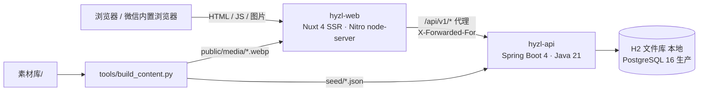

# 架构说明（本地实现版）

本文描述 `website/` 中代码的实际架构，并标出与 [K-04](../../design_document/K-04-frontend.md) 和 [K-05](../../design_document/K-05-backend.md) 目标架构的差异。差异的理由见 [ADR](./adr/)。

## 1. 组件

- **hyzl-web** 负责 SSR 渲染全部页面。浏览器只访问网站同源地址，`/api/v1/**` 由 Nitro 服务端转发给 hyzl-api。这样不需要跨域，内容服务也不必对外暴露。
- **hyzl-api** 是模块化单体，按包划分模块：

  | 包 | 职责 |
  |---|---|
  | `content` | 公开内容只读接口、可见性规则、种子导入 |
  | `lead` | 留资、字段加密、去重 |
  | `search` | 站内搜索 |
  | `rum` | Web Vitals 上报 |
  | `admin` | 线索管理（Bearer 令牌） |
  | `common` | 错误体、请求 ID、限流、CORS |

- **内容生产**：解析 `素材库/官网补录文字.txt` 与原图，套用勘误表，输出种子 JSON 与 WebP 图片。证书类图片同时加水印并生成缩略图。

## 2. 接口一览

| 方法 | 路径 | 说明 |
|---|---|---|
| GET | `/api/v1/content/{type}` | 列表。参数：`category`（逗号分隔）、`featured`、`archived`、`within`（天）、`limit`。返回 `{total, items}` |
| GET | `/api/v1/content/{type}/{slug…}` | 单条（slug 可含 `/`，如 `news/2020/company-01`）。不存在返回 404 `CONTENT_NOT_FOUND` |
| GET | `/api/v1/search?q=&type=&page=&size=` | 搜索。产品代号精确匹配优先，同分按 产品 > 方案 > 案例 排序。每 IP 30 次 / 分钟 |
| POST | `/api/v1/leads` | 留资：201 新建；24 小时内同一手机或邮箱重复提交返回 200 和原 id。每 IP 5 次 / 10 分钟 |
| POST | `/api/v1/rum` | Web Vitals 批量上报（≤ 20 条），按采样率入库 |
| GET | `/admin/v1/leads` | 线索列表，默认脱敏；`reveal=true` 显示明文并写审计 |
| PATCH | `/admin/v1/leads/{id}` | 状态流转：`new→assigned→contacted→qualified`，`invalid` 分支。非法流转返回 409 |
| GET | `/actuator/health`、`/api/health` | API / 网站健康检查 |
| GET | `/api/v1/docs`、`/api/v1/openapi` | Swagger UI / OpenAPI |

`type` 取值：

| 类型 | 说明 |
|---|---|
| `page` | common / home / about / support / privacy |
| `product` | 产品 |
| `solution` | 行业方案 |
| `case` | 案例 |
| `news` | 新闻 |
| `standard` | 标准 |
| `patent` | 专利 |
| `copyright` | 软件著作权 |
| `project` | 科研项目 |
| `award` | 奖项 |
| `certificate` | 证书 |
| `partner` | 合作单位 |
| `lab` | 实验室 |
| `job` | 招聘职位 |

错误体统一为 `{code, message, requestId, details[]}`，响应头带 `X-Request-Id`。

## 3. 数据

见 `apps/api/src/main/resources/db/migration/V1__init.sql`。

| 表 | 内容 |
|---|---|
| `content_item` | 统一内容表。公共字段（类型、slug、标题、分类、排序、发布 / 到期日期、授权、归档）为列，各类型特有字段放在 `body_json`。理由见 [ADR-0002](./adr/0002-content-model.md) |
| `content_meta` | 种子哈希等元数据 |
| `leads` | 线索。手机号、邮箱以 SM4-GCM 加密存储，另存 HMAC-SHA256 哈希用于去重；IP 只存哈希 |
| `audit_logs` | 后台查看明文、变更状态的审计 |
| `rum_metrics` | 性能上报 |

## 4. 内容规则（服务端执行）

| 规则 | 实现 |
|---|---|
| 未授权案例不返回 | `ContentService.visible`，搜索同样过滤 |
| 证书过期自动下线，≤ 60 天标记"即将到期" | `ContentService.visible` / `decorate`，时区 Asia/Shanghai |
| 首页新闻区块近 12 个月 ≥ 3 条才显示 | 前端 `within=365` 查询 + 条数判断 |
| 量化指标带脚注 | 首页数字 1—4 对应脚注，来源写明 |
| 历史动态 | 2020 年及以前新闻 `archived=true`，列表与详情显示"历史动态" |

## 5. 前端要点

| 主题 | 做法 |
|---|---|
| 设计 Token | `app/assets/css/main.css` 的 `@theme` 与 [design-tokens.json](../../design_document/assets/design-tokens.json) 一致：华云蓝 #05348E、行动橙 #C2471A（白字按钮）、深海军蓝 #0A1A3F，圆角 4px |
| 组件 | `ui/` 是无业务基础组件（按钮、图标、面包屑、灯箱、锚点导航、数字组）；`sections/` 是业务区块（产品 / 案例 / 新闻 / 证书卡、架构图、留资表单） |
| 可访问性 | 跳转到主内容链接、可见焦点环、表单错误与字段关联并自动聚焦首个错误；动画可暂停，尊重"减少动态效果"；灯箱与抽屉使用 reka-ui（焦点锁定、Esc 关闭） |
| SEO | 每页 title / description / canonical / OG；Organization、BreadcrumbList、NewsArticle 结构化数据；`sitemap.xml` 由内容动态生成 |
| 性能 | SSR 输出完整 HTML；图片 WebP、懒加载、写明尺寸；静态资源 gzip / brotli 预压缩；`/media/**` 缓存 30 天；Web Vitals 采样上报 |

## 6. 与目标架构的差异

| 目标架构（K-04 / K-05 / K-07） | 本期实现 | 后续 |
|---|---|---|
| Spring Boot 3.x + MyBatis-Plus | Spring Boot 4.1 + `JdbcClient` | ADR-0001 |
| 内容管理后台 hyzl-admin（Vue 3 SPA）、OIDC SSO、RBAC | 内容以种子 JSON 为准；线索管理只提供 Bearer 令牌接口 | ADR-0003 |
| Redis（缓存、限流、SWR 共享） | 进程内限流；接口 `Cache-Control: max-age=300` | 多实例部署前接入 Redis |
| PostgreSQL 中文全文检索（zhparser） | 内存检索（约 250 条内容） | 内容量 > 2,000 条时切换 |
| 风险触发式验证码 | 蜜罐字段 + IP 限流 | 接入云厂商验证码 |
| 资料下载 P-61、英文站 | 未实现（素材尚未就绪） | ADR-0003 |
| 容器化、CDN、WAF、监控告警 | 本地脚本运行 | 按 K-07 实施 |
